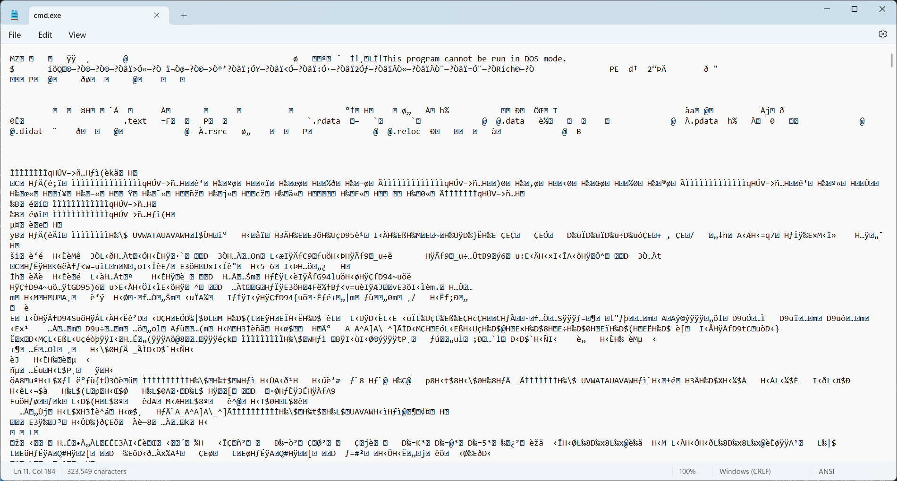
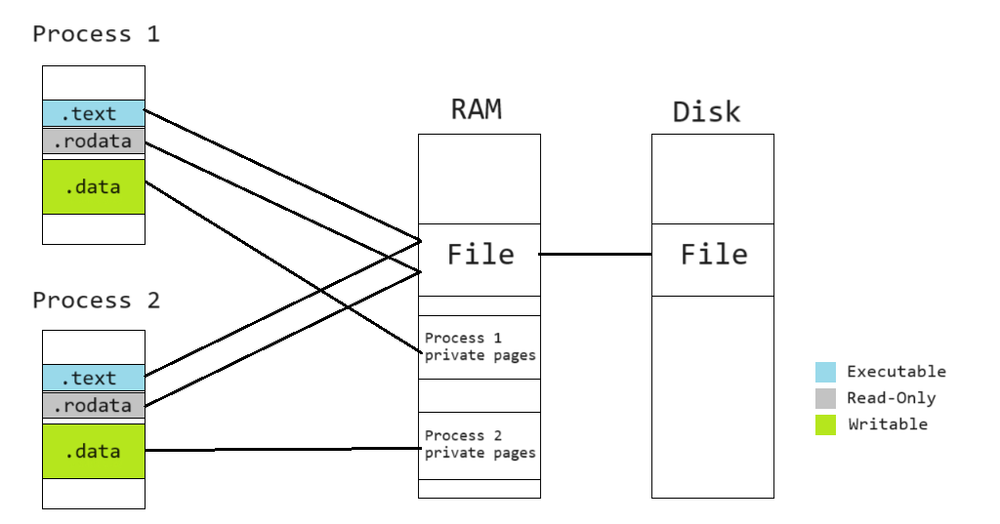
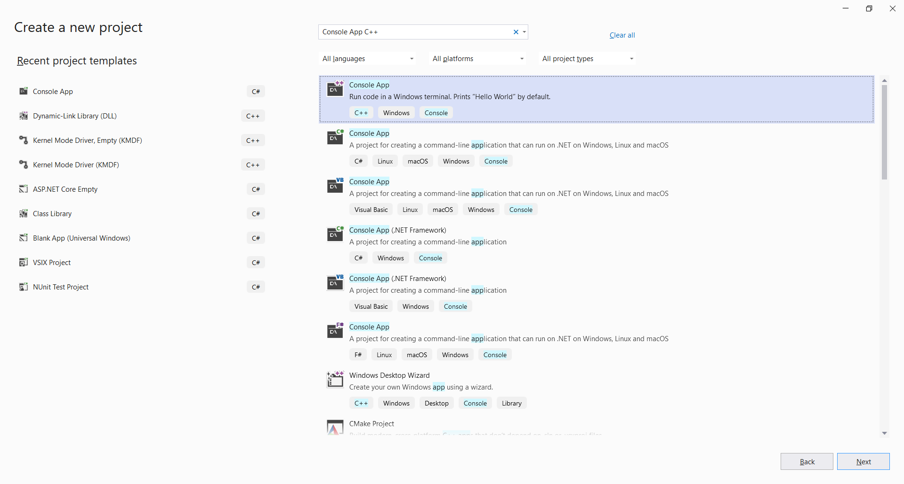
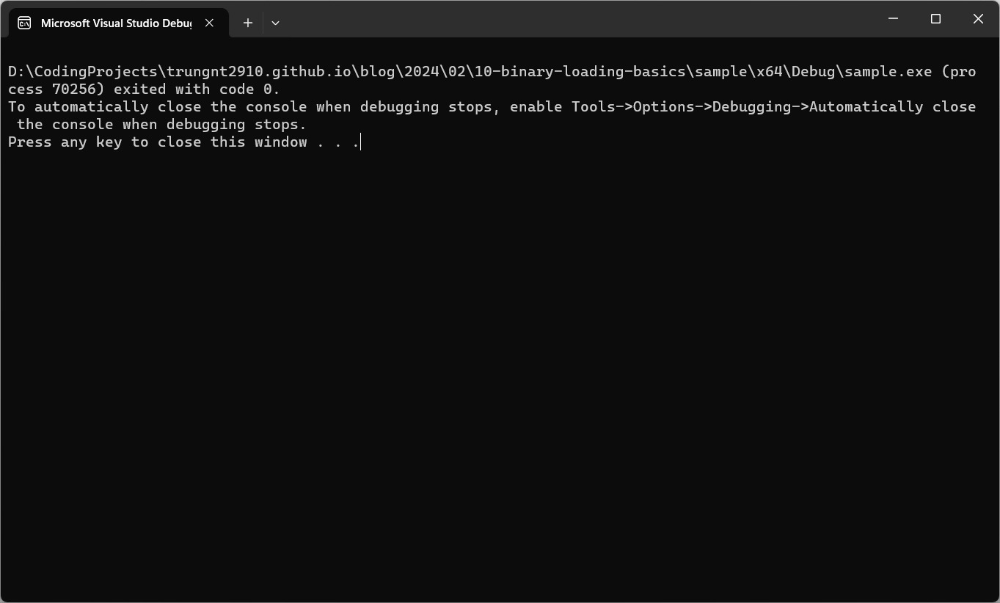

Ever wondered how a program executable file are loaded by the operating system, despite these files
appearing as random blobs of data when opened through a text editor?



This post gives you all the answers.

<!-- truncate -->

## Prerequisites

- Basic knowledge of the C++ programming language and command line tools.
- A Windows C/C++ development environment, preferably
[Visual Studio](https://learn.microsoft.com/en-us/cpp/build/vscpp-step-0-installation).
- The `nasm`, `gcc`, and `objdump` tools. They can be installed on any Linux distro, including
those running on top of [WSL](https://learn.microsoft.com/en-us/windows/wsl/setup/environment).

## What's inside an executable file

An executable file is a representation of a computer program.

As learned before, a program contains two parts: _code_ and _data_. These two components are also
what's inside an executable file.

Executable files also contain instructions for the operating system to prepare the code and data,
mostly located in "section headers". You can use the `objdump` tool to explore these headers:

```
trung@DESKTOP-5OCA2N2:~$ objdump -h /bin/bash

/bin/bash:     file format elf64-x86-64

Sections:
Idx Name          Size      VMA               LMA               File off  Algn
  0 .interp       0000001c  0000000000000318  0000000000000318  00000318  2**0
                  CONTENTS, ALLOC, LOAD, READONLY, DATA
  1 .note.gnu.property 00000030  0000000000000338  0000000000000338  00000338  2**3
                  CONTENTS, ALLOC, LOAD, READONLY, DATA
  2 .note.gnu.build-id 00000024  0000000000000368  0000000000000368  00000368  2**2
                  CONTENTS, ALLOC, LOAD, READONLY, DATA
  3 .note.ABI-tag 00000020  000000000000038c  000000000000038c  0000038c  2**2
                  CONTENTS, ALLOC, LOAD, READONLY, DATA
  4 .gnu.hash     00004cb8  00000000000003b0  00000000000003b0  000003b0  2**3
                  CONTENTS, ALLOC, LOAD, READONLY, DATA
  5 .dynsym       0000f168  0000000000005068  0000000000005068  00005068  2**3
                  CONTENTS, ALLOC, LOAD, READONLY, DATA
  6 .dynstr       0000a143  00000000000141d0  00000000000141d0  000141d0  2**0
                  CONTENTS, ALLOC, LOAD, READONLY, DATA
  7 .gnu.version  0000141e  000000000001e314  000000000001e314  0001e314  2**1
                  CONTENTS, ALLOC, LOAD, READONLY, DATA
  8 .gnu.version_r 000000f0  000000000001f738  000000000001f738  0001f738  2**3
                  CONTENTS, ALLOC, LOAD, READONLY, DATA
  9 .rela.dyn     0000e2e0  000000000001f828  000000000001f828  0001f828  2**3
                  CONTENTS, ALLOC, LOAD, READONLY, DATA
 10 .rela.plt     000014b8  000000000002db08  000000000002db08  0002db08  2**3
                  CONTENTS, ALLOC, LOAD, READONLY, DATA
 11 .init         0000001b  000000000002f000  000000000002f000  0002f000  2**2
                  CONTENTS, ALLOC, LOAD, READONLY, CODE
 12 .plt          00000de0  000000000002f020  000000000002f020  0002f020  2**4
                  CONTENTS, ALLOC, LOAD, READONLY, CODE
 13 .plt.got      00000030  000000000002fe00  000000000002fe00  0002fe00  2**4
                  CONTENTS, ALLOC, LOAD, READONLY, CODE
 14 .plt.sec      00000dd0  000000000002fe30  000000000002fe30  0002fe30  2**4
                  CONTENTS, ALLOC, LOAD, READONLY, CODE
 15 .text         000e573a  0000000000030c00  0000000000030c00  00030c00  2**4
                  CONTENTS, ALLOC, LOAD, READONLY, CODE
 16 .fini         0000000d  000000000011633c  000000000011633c  0011633c  2**2
                  CONTENTS, ALLOC, LOAD, READONLY, CODE
 17 .rodata       00019df0  0000000000117000  0000000000117000  00117000  2**5
                  CONTENTS, ALLOC, LOAD, READONLY, DATA
 18 .eh_frame_hdr 0000492c  0000000000130df0  0000000000130df0  00130df0  2**2
                  CONTENTS, ALLOC, LOAD, READONLY, DATA
 19 .eh_frame     0001c358  0000000000135720  0000000000135720  00135720  2**3
                  CONTENTS, ALLOC, LOAD, READONLY, DATA
 20 .init_array   00000008  00000000001529b0  00000000001529b0  001529b0  2**3
                  CONTENTS, ALLOC, LOAD, DATA
 21 .fini_array   00000008  00000000001529b8  00000000001529b8  001529b8  2**3
                  CONTENTS, ALLOC, LOAD, DATA
 22 .data.rel.ro  00002b20  00000000001529c0  00000000001529c0  001529c0  2**5
                  CONTENTS, ALLOC, LOAD, DATA
 23 .dynamic      00000200  00000000001554e0  00000000001554e0  001554e0  2**3
                  CONTENTS, ALLOC, LOAD, DATA
 24 .got          00000920  00000000001556e0  00000000001556e0  001556e0  2**3
                  CONTENTS, ALLOC, LOAD, DATA
 25 .data         000087b0  0000000000156000  0000000000156000  00156000  2**5
                  CONTENTS, ALLOC, LOAD, DATA
 26 .bss          0000afb0  000000000015e7c0  000000000015e7c0  0015e7b0  2**5
                  ALLOC
 27 .gnu_debuglink 00000034  0000000000000000  0000000000000000  0015e7b0  2**2
                  CONTENTS, READONLY
```

Or, using the tool on a Windows binary

```
trung@DESKTOP-5OCA2N2:~$ objdump -h /mnt/c/Windows/System32/cmd.exe

/mnt/c/Windows/System32/cmd.exe:     file format pei-x86-64

Sections:
Idx Name          Size      VMA               LMA               File off  Algn
  0 .text         0003463d  0000000140001000  0000000140001000  00001000  2**4
                  CONTENTS, ALLOC, LOAD, READONLY, CODE
  1 .rdata        00009602  0000000140036000  0000000140036000  00036000  2**4
                  CONTENTS, ALLOC, LOAD, READONLY, DATA
  2 .data         00001000  0000000140040000  0000000140040000  00040000  2**4
                  CONTENTS, ALLOC, LOAD, DATA
  3 .pdata        00002568  000000014005c000  000000014005c000  00041000  2**2
                  CONTENTS, ALLOC, LOAD, READONLY, DATA
  4 .didat        000000a8  000000014005f000  000000014005f000  00044000  2**2
                  CONTENTS, ALLOC, LOAD, DATA
  5 .rsrc         000084f8  0000000140060000  0000000140060000  00045000  2**2
                  CONTENTS, ALLOC, LOAD, READONLY, DATA
  6 .reloc        000001d0  0000000140069000  0000000140069000  0004e000  2**2
                  CONTENTS, ALLOC, LOAD, READONLY, DATA
```

Notice some labels attached to the sections:
- `CODE`: The section contains machine code.
- `DATA`: The section contains data.
- `READONLY`: The section is meant to be readonly. This is applied to most code sections and some
data sections holding constants.

Also notice some common section names:
- `.text`: A readonly section, usually code.
- `.data`: A section containing data, usually writable. The section stores the initial values of
variables.
- `.rodata` or `.rdata`: A section containing constant data.

## The ELF format

Looking closely at the `/bin/bash` example above, you can see that the file format is specified
as `elf64-x86-64`. ELF (the **E**xecutable **L**inkable **F**ormat) is the most popular executable
format, used in most operating systems except Windows (using the **P**ortable **E**xecutable) and
macOS (using Mach-O).


While the format seems complex with a lot of information to support different scenarios, to build
our first loader, we only need to care about these parts:

### File header

Contains general information about the executable. Located right at the beginning of the file.

- `e_ident[EI_MAG0]` through `e_ident[EI_MAG3]`: The ELF magic number: `0x7F`, `'E'`, `'L'`,
`'F'`. These 4 bytes are used to verify whether the file in question is actually an ELF file.
- `e_entry`: The entry point. This is the pointer to the binary's starting function.
- `e_phoff`: The pointer to the _program headers_, relative to the file's start address.
- `e_phnum`: The number of _program headers_.

### Program header

Contains more information about the program included in the executable.

- `p_type`: The header type. As a simple loader, we only need to take care of `PT_LOAD` headers.
- `p_flags`: Memory protection flags for the section. Will be discussed more below.
- `p_offset`: Pointer to the data this header represents, relative to the file's start address.
- `p_vaddr`: The address this segment should be loaded in memory.
- `p_filesz`: Size in bytes of the data contained in the original file. These bytes have to
be mapped into memory by the loader.
- `p_memsz`: Size in bytes of the data mapped into memory. This size can be greater than
`p_filesz`, in which case the OS usually fill the excess part with zeroes.

Don't worry, all of this will be clear once we start writing our loader.

## Memory mappings

Usually, the operating system runs multiple processes sharing the same executable file, such as
when the user opens two different `cmd.exe` windows. In this case, reading the executable file
and copying the data into memory allocated by normal C++ routines would result in the binary being
written multiple times in RAM.

To solve this problem, operating systems have a mechanism to map the same _physical pages_ (memory
regions residing in RAM) to different _virtual pages_ (memory regions in each process's separate
_virtual address space_). The physical pages can either be set to mirror a file on disk, or
represent "anonymous" memory not associated with any file.



To map files to memory, on Windows, we use the `MapViewOfFile` function. On other OSes, the
equivalent function is `mmap`.

To protect important data from being unintentionally corrupted by programming errors, each virtual
page is usually "protected" with one of the following three flags:
- `READ`: The page can be read.
- `WRITE`: The page can be write.
- `EXECUTE`: The page has machine code that can be executed by the CPU.

Attempting to access (read, write, execute code) on a virtual page without the appropriate flag set
will result in an _access violation_ exception (which normally crashes the program).

The `p_flags` value in the ELF Program Header mentioned above instructs the loader to set the
corresponding protection values to the pages containing the mapped data after loading. On Windows,
we can use the `VirtualProtect` function for this (`mprotect` on most other OSes).

## Creating our loader

To understand the theory above, let us get our hands dirty and create a new ELF loader from
scratch!

Since there has been so so many ELF loaders for Linux and other UNIX OSes, let's do something
a bit different: An ELF loader for Windows.

### Creating the project

Launch Visual Studio, click "Create a new project" on the options on the right, and create a new
C/C++ console application.



Make sure the selected language is C++.

### Including the `elf.h` header

Windows does not have built-in structure definitions for handling the ELF format. We would need to
grab the header
[here](https://github.com/trungnt2910/trungnt2910.github.io/raw/master/blog/2024/02/10-binary-loading-basics/sample/elf.h)
and add it to our project.

Download the `elf.h` file to your project folder. Then, from the Solution Explorer, right click
"Header Files", choose Add -> Existing Item, and point to your newly downloaded header.

### Reading the ELF file

Start by nuking all the contents in the `.cpp` file Visual Studio has created for you.

Let's include a few headers:

```cpp
// Silence some warnings when using `fopen`
#define _CRT_SECURE_NO_WARNINGS

#include <stdio.h>
#include <vector>
#include <Windows.h>

#include "elf.h"
```

And add a few helper macros:

```cpp
// Select the correct ELF structures depending on whether the program is 32 or 64 bits.
#ifdef _WIN64
#define ElfW(type) Elf64_##type
#elif defined _WIN32
#define ElfW(type) Elf32_##type
#endif
```

Then, create our `main` function:

```cpp
int main()
{
    // r: Read-only
    // b: Binary mode
    // We have to explicitly specify binary mode, otherwise the OS might do conversions specific to
    // text files that may corrupt our bytes.
    FILE* elfFile = fopen("elf", "rb");

    // Read the ELF header

    ElfW(Ehdr) header;
    fread(&header, sizeof(header), 1, elfFile);

    if (!IS_ELF(header))
    {
        fprintf(stderr, "Not an ELF file.\n");
        return 1;
    }

    std::vector<ElfW(Phdr)> programHeaders(header.e_phnum);
    fread(programHeaders.data(), sizeof(ElfW(Phdr)), header.e_phnum, elfFile);
}
```

At this stage, we have obtained the ELF header and program headers. Let's proceed to mapping the
binary sections.

### Mapping the pages

Theoretically, the program headers can specify arbitrary mappings between file sections and virtual
address pages. However, to simplify our loader, let's make a few assuptions (which are actually
true for many ELF executables generated by compilers):
- The data pointed to by program headers both are in consecutive file sections and should be mapped
to consecutive virtual pages.
- The first program header points to the start of the ELF file (`p_offset == 0`).
- Most headers have `p_filesz` equal to `p_memsz`, except for one last section with `p_memsz` being
greater. This last part is often the writable `.data` section, where a portion is preinitialized
with data and the rest filled with `0`s.

Knowing that the sections reside in a continuous region of the process's address space, let's
determine that by looping through the headers:

```cpp
    // Read the program headers and determine the executable file's address in memory.

    uintptr_t minAddr = -1;
    uintptr_t maxAddr = 0;

    for (const auto& programHeader : programHeaders)
    {
        if (programHeader.p_type != PT_LOAD)
        {
            continue;
        }

        minAddr = min(minAddr, programHeader.p_vaddr);
        maxAddr = max(minAddr, (programHeader.p_vaddr + programHeader.p_memsz));
    }
```

Then, we can do some Win32 magic to map the file to memory:

```cpp
    // Obtain a Win32 handle to the file

    HANDLE elfFileHandle = CreateFile(L".\\elf",
        GENERIC_READ | GENERIC_EXECUTE,
        FILE_SHARE_READ | FILE_SHARE_WRITE,
        NULL,
        OPEN_EXISTING,
        FILE_ATTRIBUTE_NORMAL,
        NULL);

    // Obtain a file mapping object

    HANDLE elfFileMappingHandle = CreateFileMapping(elfFileHandle,
        NULL,
        PAGE_EXECUTE_READ,
        0,
        0,
        NULL);

    // Map the file into memory

    MapViewOfFileEx(
        elfFileMappingHandle,
        FILE_MAP_READ | FILE_MAP_EXECUTE | FILE_MAP_COPY,
        0, 0,
        maxAddr - minAddr,
        (void*)minAddr
    );
```

The most interesting part here is how `CreateFile` gets called with only read/execute permissions.
We do not want (and sometimes cannot) write any data back into the executable file, potentially
corrupting the binary's data. However, as mentioned above, some parts, like the one representing
the `.data` section, needs to be mapped read/write. To allow creating a read/write mapping that
saves the changes into RAM without mirroring back into the original executable file, we pass
the `FILE_MAP_COPY` to `MapViewOfFileEx` in addition to other permission flags. This instructs the
operating system to use the
[_copy-on-write_](https://en.wikipedia.org/wiki/Copy-on-write#In_virtual_memory_management)
technique for this region.

To know more about what these functions do, you can look at their documentation pages:
- [`CreateFile`](https://learn.microsoft.com/en-us/windows/win32/api/fileapi/nf-fileapi-createfilea)
- [`CreateFileMapping`](https://learn.microsoft.com/en-us/windows/win32/api/winbase/nf-winbase-createfilemappinga)
- [`MapViewOfFileEx`](https://learn.microsoft.com/en-us/windows/win32/api/memoryapi/nf-memoryapi-mapviewoffileex)

### Protecting the pages

After `MapViewOfFileEx`, all mapped memory are marked readable/writable/executable. This is mostly
undesirable since we usually do not want to modify code and execute data sections.

To fix this, we loop through all the program headers again and apply the approriate protection
to the corresponding memory regions using
[`VirtualProtect`](https://learn.microsoft.com/en-us/windows/win32/api/memoryapi/nf-memoryapi-virtualprotect).

```cpp
    // Set the page protections

    const auto ElfProtectionToWindows = [](ElfW(Word) elfFlags)
    {
        static const int table[2][2][2] =
        {
            // Not executable
            {
                // Not writable
                { PAGE_NOACCESS, PAGE_READONLY },
                // Writable
                { PAGE_WRITECOPY, PAGE_WRITECOPY }
            },
            // Executable
            {
                // Not writable
                { PAGE_EXECUTE, PAGE_EXECUTE_READ },
                // Writable
                { PAGE_EXECUTE_WRITECOPY, PAGE_EXECUTE_WRITECOPY }
            }
        };

        return table[(bool)(elfFlags & PF_X)][(bool)(elfFlags & PF_W)][(bool)(elfFlags & PF_R)];
    };

    for (const auto& programHeader : programHeaders)
    {
        if (programHeader.p_type != PT_LOAD)
        {
            continue;
        }

        unsigned long oldProtect;
        VirtualProtect(
            (void*)programHeader.p_vaddr,
            programHeader.p_memsz,
            ElfProtectionToWindows(programHeader.p_flags),
            &oldProtect
        );
    }
```

Note that the `ElfProtectionToWindows` cannot properly convert the protection if the ELF flags
specify `PF_W` without other values (write-only regions). In this case, the corresponding Windows
protection translate to read-write access. This should not be a problem in most cases, since
write-only regions are rare, and in most CPU architectures, write access to a virtual page implies
read access as well.

### Jumping to our entry point

With our executable set up in memory, let's run it!

```cpp
    // Function that takes no parameters and returns an `int`.
    int (*entry)() = (int (*)())header.e_entry;

    return entry();
```

Normally, control should not return to our `main()` after `entry()` is called, since most
executables contain code instructing the operating system to terminate the process at the end of
its entry function. However, since we cannot use Linux's `exit` syscall when running the code on
Windows, we will craft a special ELF that normally handles control to the parent function after
finishing execution.

## Crafting our test ELF

Now that we have our loader, let's create a very simple executable for testing:

```nasm
global _start

section .text
_start:
    mov rax, 0
    ret
```

On a Linux machine, compile it with:

```
nasm -felf64 elf.s -o elf.o
gcc elf.o -o elf -static -nostdlib
```

If you cannot build it yourself, you can grab a copy
[here](https://github.com/trungnt2910/trungnt2910.github.io/raw/master/blog/2024/02/10-binary-loading-basics/sample/elf).

This binary does nothing except returning a single `0` to indicate success.

At this stage, we cannot throw normal Linux binaries at our loader yet, because:
- Our loader cannot handle more complex ELF executables. The most important features it is missing
are relocation and dynamic object resolution.
- Linux binaries cannot run directly on Windows due to incompatible Application Binary Interfaces
(ABIs). In other words, Windows normally does not provide the expected facilities that machine code
built for Linux expect.

Let's add our binary to the project, by copying it to the project folder, right-clicking the
project in the Solution Explorer, choosing Add -> Existing Item, and pointing to the `elf` file.

Everything should work, and the program should return 0!



## Conclusion

After following this post, you should all be able to write your own executable loader for ELF, or
even your favorite binary formats (PE and Mach-O are different but follow the same principles).

The sample project is provided
[on GitHub](https://github.com/trungnt2910/trungnt2910.github.io/tree/master/blog/2024/02/10-binary-loading-basics/sample).

If you like my blog and want me to expand on this topic in the future, or have any ideas to improve
this article, please leave a comment.

Stay tuned for my future guides! Meanwhile, check out these additional resources:
- [Wikipedia - Executable and Linkable Format](https://en.wikipedia.org/wiki/Executable_and_Linkable_Format)
- [Microsoft Learn - File Mapping](https://learn.microsoft.com/en-us/windows/win32/memory/file-mapping)
- [HelloElf](https://github.com/trungnt2910/HelloElf) - A former attempt to load and run x86_64
Linux ELF binaries on Windows. Contains a similar ELF loader and basic emulation code for some
aspects of the Linux ABI.
