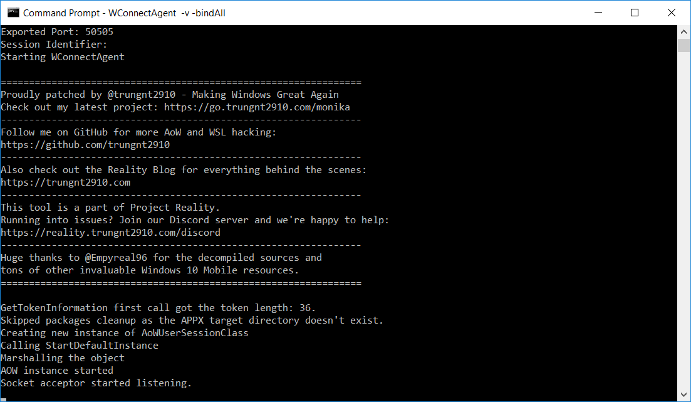
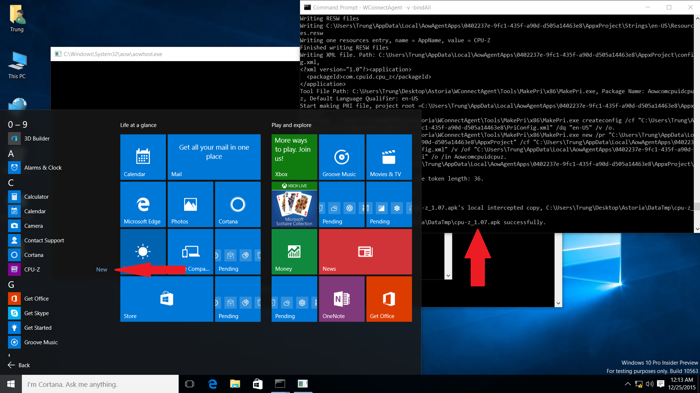
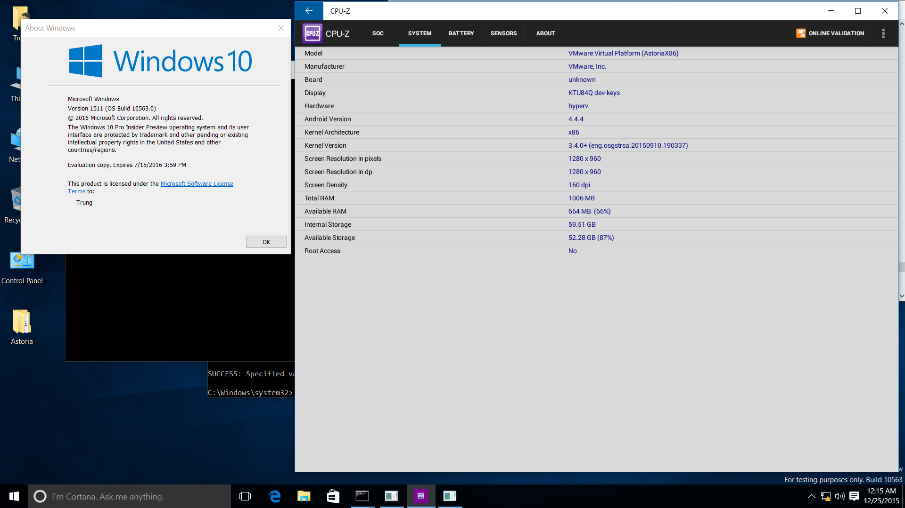

<head>
    <meta property="og:image" content={require('./lost_android.png').default} />
    <meta name="twitter:image" content={require('./lost_android.png').default} />
</head>

Are you a die-hard fan of _Project Astoria_, Microsoft's former solution to bridging the app gap on
Windows 10 Mobile? Or are you just tired of your average sluggish, resource-hogging Android
emulator?

This post, exploring the method to bring Astoria to various unsupported Windows versions, from
different platforms like Desktop to higher builds like the Anniversary Update (RS1) and beyond, is
just for _you_.

<figure>
    
    <figcaption style={{fontStyle: "italic", textAlign: "center"}}>
        Generated by Microsoft Copilot.
    </figcaption>
</figure>

<!-- truncate -->

## Introduction

_Project Astoria_, (a.k.a _Windows Bridge for Android_), was an attempt to allow Android apps to
run on early prerelease builds of Windows 10 Mobile. It was available exclusively to Mobile builds
and canceled before the public release of Windows version 1511 ("Thresold 2").

The solution features an Android 4.4 environment running on a compatibility layer (`lxcore.sys`)
that translates Linux syscalls issued by the Android runtime to equivalent Windows NT calls. With
the help of more glue services, Astoria allowed many Android applications to run alongside with
native Windows apps and seamlessly integrate into the environment with little performance penalty,
unlike existing solutions which spawns a full virtual machine.

While only released for mobile, the design of Astoria theoretically also supports other variants of
Windows 10. After its demise, the project had a second life as the _Windows Subsystem for Linux_,
created to run console Linux applications, before being abandoned in favor of a brute-force Hyper-V
solution in 2020.

## Prerequisites

- General Windows power user techniques (e.g. modifying the registry and system files).
- Using Project Astoria to install APKs on supported Windows 10 Mobile versions. A general guide
can be found
[here](https://www.wpxbox.com/this-tool-lets-you-run-android-apks-on-windows-10-mobile).

## Preparing

Being a complex component, Astoria involves multiple files and expects the system to have certain
features and configurations available.

<figure>
    
    <figcaption style={{fontStyle: "italic", textAlign: "center"}}>
        Overview of Components of Project Astoria.
    </figcaption>
</figure>

### Windows 10 Version

This guide is tested on Windows 10 x86 build 10563.

**32-bit** Windows 10 variants up to build 10572 should work.

Some features may work on early Redstone 1 preview **32-bit** builds (builds 14251 - 14346).

Full access to the filesystem and registry is expected. This is generally true for `Administrators`
on normal Windows, but may require additional setup on Windows 10 Mobile.

<details>
    <summary>Why?</summary>

    As shown on the diagram above, the core driver of Astoria requires a specific kernel function,
    `PsRegisterPicoProvider`.

    Windows TH2 builds starting from 10575 are known to block this function entirely, returning an
    error code in all cases. This function got unblocked in the RS1 branch to pave the way for WSL,
    but experienced an ABI break starting from build 14347, preventing Astoria drivers to load on
    newer versions of Windows.

    Since Windows 10 Mobile is 32-bit only (`arm32` for native devices and `x86` for emulators),
    and Astoria is only published for Windows 10 Mobile, the component is exclusive to 32-bit
    Windows editions.

    While early RS1 builds possess the necessary kernel facilities, breaking changes have been made
    to userland services handling AppX packages and UWP apps, preventing the deployment of Astoria-
    based AppX files. For Mobile variants, the latest known fully functional build is
    [14320](https://empyreal96.github.io/ProjectAstoria/installation.html), while on Desktop, none
    of the RS1 builds can deploy Astoria packages correctly, despite having correctly launched the
    Android container.
</details>

<details>
    <summary>Overcoming the Time Bomb</summary>

    All of the listed supported builds are Windows Insider Preview builds with a fixed expiration
    date long long ago.

    Before installing or booting, make sure your hardware clock is set to some time in 2015 and any
    time synchronization mechanism is disabled. Otherwise, installation will fail and/or Windows
    will refuse to boot (hence, the "Time Bomb").

    If you are using VMWare, adding these lines to your `.vmx` configuration might help:

    ```
    rtc.startTime = "1450962000"
    tools.syncTime = "FALSE"
    time.synchronize.continue = "FALSE"
    time.synchronize.restore = "FALSE"
    time.synchronize.resume.disk = "FALSE"
    time.synchronize.shrink = "FALSE"
    time.synchronize.tools.startup = "FALSE"
    time.synchronize.tools.enable = "FALSE"
    time.synchronize.resume.host = "FALSE"
    ```
</details>

### Files

The following files should be extracted from a Windows 10 Mobile image with a close build number.
Files for late TH2 builds (builds 105xx) should work for supported RS1 installations (builds 14xxx).

The guide includes files and registry values extracted from Windows 10 Mobile Emulator Build 10563.
Registry keys and deployment tools can be shared across architectures, but drivers, core AoW files,
and security catalogs must match the architecture of your target system.

You can download all the files used in this guide in this
[big zip file](https://github.com/trungnt2910/trungnt2910.github.io/releases/download/v0.0.0/Astoria.zip).

#### Core Drivers (`C:\Windows\System32\drivers`)

Two files are required: [`adss.sys`](./files/adss.sys) and [`lxcore.sys`](./files/lxcore.sys).

<details>
    <summary>What are they?</summary>

    These are the core drivers responsible for translating Linux system calls to Windows NT
    equivalents. They are the lowest level components of Astoria.
</details>

#### AoW Files (`C:\Windows\System32\aow`)

The whole
[`aow`](https://github.com/trungnt2910/trungnt2910.github.io/releases/download/v0.0.0/aow.zip)
directory is required.

<details>
    <summary>What are they?</summary>

    The folder name, `aow` - Android on Windows - should be self-explanatory.

    It contains a full Android image (`aow.wim`), Windows services used to start and communicate
    with the Android container, and some other libraries used by Astoria components.
</details>

#### Registry Keys

Several registry keys need to be imported.

Registry entries should be the same for both ARM32 and x86 versions of Windows.

##### Drivers

Apply [`adss.reg`](./keys/adss.reg) to register the core Astoria drivers.

<details>
    <summary>Keys involved</summary>

    ```
    [HKEY_LOCAL_MACHINE\SYSTEM\CurrentControlSet\Services\adss]
    [HKEY_LOCAL_MACHINE\SYSTEM\CurrentControlSet\Control\ManufacturingMode\Default\Services\adss]
    ```

    The first key is essential for all Windows driver registrations.<br/>
    The second key does not appear to be important but is present in W10M builds with Astoria.
</details>

##### Services

Apply [`AoWSM.reg`](./keys/AoWSM.reg) to register the AoW Session Manager service. This is the main
userland component of Astoria.

<details>
    <summary>Keys involved</summary>

    ```
    [HKEY_LOCAL_MACHINE\SYSTEM\CurrentControlSet\Services\AoWSM]
    [HKEY_LOCAL_MACHINE\SYSTEM\CurrentControlSet\Services\AoWSM\parameters]
    [HKEY_LOCAL_MACHINE\SYSTEM\CurrentControlSet\Services\AoWSM\Security]
    ```
</details>

Also, run [`AoWSM.cmd`](./keys/AoWSM.cmd) as Administrator to add the service to the correct service
user.

<details>
    <summary>Keys involved</summary>

    ```
    [HKEY_LOCAL_MACHINE\SOFTWARE\Microsoft\Windows NT\CurrentVersion\Svchost]
    ```
</details>

<details>
    <summary>Why a script?</summary>

    The installation process involves updating a `REG_MULTI_SZ` value by appending the service name
    (`AoWSM`) to an existing list. The list of services may be different in each build and each
    Windows installation.

    Windows `.reg` files only support replacing whole values, not appending a new entry to a
    `REG_MULTI_SZ`. Therefore, commands are used to read the whole list, add the required value,
    and write the list back again.

    ```cmd
    SET ContentsToBeAppended=\0AoWSM
    FOR /F "tokens=2,3*" %%G IN ('REG QUERY "HKEY_LOCAL_MACHINE\SOFTWARE\Microsoft\Windows NT\CurrentVersion\Svchost" /v netsvcs') DO SET EntryContents=%%H
    SET NewEntryContents=%EntryContents%%ContentsToBeAppended%

    REG ADD "HKEY_LOCAL_MACHINE\SOFTWARE\Microsoft\Windows NT\CurrentVersion\Svchost" /v netsvcs /t REG_MULTI_SZ /d "%NewEntryContents%" /f
    ```
</details>

##### Certificates

Apply [`MicrosoftTestRootAuthority.reg`](./keys/MicrosoftTestRootAuthority.reg) to register the
`Microsoft Test Root Authority`. This is the authority for certificates found in Astoria and other
test components in Win10M preview builds.

<details>
    <summary>Keys involved</summary>

    ```
    [HKEY_LOCAL_MACHINE\SOFTWARE\Microsoft\SystemCertificates\ROOT\Certificates\2BD63D28D7BCD0E251195AEB519243C13142EBC3]
    ```
</details>

##### Policies

Apply
[`AllowWindowsBridgeForAndroidAppExecution.reg`](./keys/AllowWindowsBridgeForAndroidAppExecution.reg)
to enable a hidden policy allowing AoW apps to run. Without this policy set to enabled, Astoria
services simply refuse to start.

<details>
    <summary>Keys involved</summary>

    ```
    [HKEY_LOCAL_MACHINE\SOFTWARE\Microsoft\PolicyManager\default\ApplicationManagement\AllowWindowsBridgeForAndroidAppExecution]
    ```
</details>

##### AoW Configuration

Apply [`AoWCOM.reg`](./keys/AoWCOM.reg) to register necessary COM interfaces used by Astoria.

<details>
    <summary>Keys involved</summary>

    ```
    [HKEY_LOCAL_MACHINE\SOFTWARE\Classes\AppId\{86a8127c-3121-4879-bef7-08df0ed05a76}]
    [HKEY_LOCAL_MACHINE\SOFTWARE\Classes\AppId\{a4557610-bef7-40d6-844d-83dc4e1ea6f2}]
    [HKEY_LOCAL_MACHINE\SOFTWARE\Classes\CLSID\{4abf46cc-e506-434c-afa4-9927f3668e60}]
    [HKEY_LOCAL_MACHINE\SOFTWARE\Classes\CLSID\{4abf46cc-e506-434c-afa4-9927f3668e60}\InProcServer32]
    [HKEY_LOCAL_MACHINE\SOFTWARE\Classes\CLSID\{7930ac88-f36c-44fd-8202-8b95b5b06acb}]
    [HKEY_LOCAL_MACHINE\SOFTWARE\Classes\CLSID\{7930ac88-f36c-44fd-8202-8b95b5b06acb}\InProcServer32]
    [HKEY_LOCAL_MACHINE\SOFTWARE\Classes\CLSID\{86a8127c-3121-4879-bef7-08df0ed05a76}]
    [HKEY_LOCAL_MACHINE\SOFTWARE\Classes\CLSID\{86a8127c-3121-4879-bef7-08df0ed05a76}\LocalServer32]
    [HKEY_LOCAL_MACHINE\SOFTWARE\Classes\CLSID\{910065f3-db2c-41c8-a50a-aa258afac2e8}]
    [HKEY_LOCAL_MACHINE\SOFTWARE\Classes\CLSID\{da3739a3-46a5-4e9b-b2b5-9545eeea93e6}]
    [HKEY_LOCAL_MACHINE\SOFTWARE\Classes\CLSID\{da3739a3-46a5-4e9b-b2b5-9545eeea93e6}\InProcServer32]
    [HKEY_LOCAL_MACHINE\SOFTWARE\Classes\CLSID\{e213b5d9-4ee5-4e2d-945e-6508c1d050fb}]
    [HKEY_LOCAL_MACHINE\SOFTWARE\Classes\CLSID\{e213b5d9-4ee5-4e2d-945e-6508c1d050fb}\InProcServer32]
    [HKEY_LOCAL_MACHINE\SOFTWARE\Classes\Interface\{292997c8-fa0d-4fb6-8bc5-366f9382cc81}]
    [HKEY_LOCAL_MACHINE\SOFTWARE\Classes\Interface\{292997c8-fa0d-4fb6-8bc5-366f9382cc81}\ProxyStubClsid32]
    [HKEY_LOCAL_MACHINE\SOFTWARE\Classes\Interface\{355C3D14-8434-4F35-8377-FDD880F5758A}]
    [HKEY_LOCAL_MACHINE\SOFTWARE\Classes\Interface\{355C3D14-8434-4F35-8377-FDD880F5758A}\ProxyStubClsid32]
    [HKEY_LOCAL_MACHINE\SOFTWARE\Classes\Interface\{38530252-eb81-4164-8854-89e763e44514}]
    [HKEY_LOCAL_MACHINE\SOFTWARE\Classes\Interface\{38530252-eb81-4164-8854-89e763e44514}\ProxyStubClsid32]
    [HKEY_LOCAL_MACHINE\SOFTWARE\Classes\Interface\{623bbb59-1aa9-46b2-a2e6-e4a749305fcd}]
    [HKEY_LOCAL_MACHINE\SOFTWARE\Classes\Interface\{623bbb59-1aa9-46b2-a2e6-e4a749305fcd}\ProxyStubClsid32]
    [HKEY_LOCAL_MACHINE\SOFTWARE\Classes\Interface\{75888062-7a77-46c0-9494-e59f2dd4df0f}]
    [HKEY_LOCAL_MACHINE\SOFTWARE\Classes\Interface\{75888062-7a77-46c0-9494-e59f2dd4df0f}\ProxyStubClsid32]
    [HKEY_LOCAL_MACHINE\SOFTWARE\Classes\Interface\{782b2d14-179c-4540-bfc8-3599213f764e}]
    [HKEY_LOCAL_MACHINE\SOFTWARE\Classes\Interface\{782b2d14-179c-4540-bfc8-3599213f764e}\ProxyStubClsid32]
    [HKEY_LOCAL_MACHINE\SOFTWARE\Classes\Interface\{8ab860cb-32ff-4903-8f2a-5ca76ed80301}]
    [HKEY_LOCAL_MACHINE\SOFTWARE\Classes\Interface\{8ab860cb-32ff-4903-8f2a-5ca76ed80301}\ProxyStubClsid32]
    [HKEY_LOCAL_MACHINE\SOFTWARE\Classes\Interface\{a0c5d6c2-48ce-4429-a73c-5c4df8cc2a54}]
    [HKEY_LOCAL_MACHINE\SOFTWARE\Classes\Interface\{a0c5d6c2-48ce-4429-a73c-5c4df8cc2a54}\ProxyStubClsid32]
    [HKEY_LOCAL_MACHINE\SOFTWARE\Classes\Interface\{a1411706-05ec-4f1a-914a-31f7e8b12a9e}]
    [HKEY_LOCAL_MACHINE\SOFTWARE\Classes\Interface\{a1411706-05ec-4f1a-914a-31f7e8b12a9e}\ProxyStubClsid32]
    [HKEY_LOCAL_MACHINE\SOFTWARE\Classes\Interface\{b65c0692-57f8-472d-b3e4-cd754ccdcc6a}]
    [HKEY_LOCAL_MACHINE\SOFTWARE\Classes\Interface\{b65c0692-57f8-472d-b3e4-cd754ccdcc6a}\ProxyStubClsid32]
    [HKEY_LOCAL_MACHINE\SOFTWARE\Classes\Interface\{c60b7e58-8fe7-4a9c-a86e-42ca6926cc40}]
    [HKEY_LOCAL_MACHINE\SOFTWARE\Classes\Interface\{c60b7e58-8fe7-4a9c-a86e-42ca6926cc40}\ProxyStubClsid32]
    [HKEY_LOCAL_MACHINE\SOFTWARE\Classes\Interface\{e6521960-71d3-4e9f-8ecd-bb87a99313f9}]
    [HKEY_LOCAL_MACHINE\SOFTWARE\Classes\Interface\{e6521960-71d3-4e9f-8ecd-bb87a99313f9}\ProxyStubClsid32]
    [HKEY_LOCAL_MACHINE\SOFTWARE\Microsoft\SecurityManager\FullTrust]
    [HKEY_LOCAL_MACHINE\SOFTWARE\Microsoft\SecurityManager\FullTrust\AowHost]
    [HKEY_LOCAL_MACHINE\SOFTWARE\Microsoft\Windows NT\CurrentVersion\AOW]
    [HKEY_LOCAL_MACHINE\SOFTWARE\Microsoft\Windows NT\CurrentVersion\AOW\Instance]
    [HKEY_LOCAL_MACHINE\SOFTWARE\Microsoft\WindowsRuntime\AllowedCOMCLSIDs\{da3739a3-46a5-4e9b-b2b5-9545eeea93e6}]
    [HKEY_LOCAL_MACHINE\SOFTWARE\Microsoft\WindowsRuntime\AllowedCOMCLSIDs\{e213b5d9-4ee5-4e2d-945e-6508c1d050fb}]
    ```
</details>

##### Host Configuration

Apply [ArcadiaEvents.reg](./keys/ArcadiaEvents.reg) to allow certain features of Arcadia, the UWP
application host component of Astoria, to run correctly.

<details>
    <summary>Keys involved</summary>

    ```
    [HKEY_LOCAL_MACHINE\SOFTWARE\Microsoft\Windows NT\CurrentVersion\BackgroundModel\EventSettings\719]
    [HKEY_LOCAL_MACHINE\SOFTWARE\Microsoft\Windows NT\CurrentVersion\BackgroundModel\EventSettings\720]
    [HKEY_LOCAL_MACHINE\SOFTWARE\Microsoft\Windows NT\CurrentVersion\BackgroundModel\EventSettings\721]
    [HKEY_LOCAL_MACHINE\SOFTWARE\Microsoft\Windows NT\CurrentVersion\BackgroundModel\EventSettings\722]
    ```
</details>

#### Certificates

Two catalog files should be copied to
`C:\Windows\System32\CatRoot\{F750E6C3-38EE-11D1-85E5-00C04FC295EE}`, the system security catalog
store:

[`Microsoft.MS_PROJECTA.MainOS`](./files/Microsoft.MS_PROJECTA.MainOS~628844477771337a~x86~~8.15.13030.68.cat)

[`Microsoft.MobileCore.Prod.MainOS`](./files/Microsoft.MobileCore.Prod.MainOS~628844477771337a~x86~~8.20.10563.11786.cat)

<details>
    <summary>What are they?</summary>

    On Windows, security catalogs (files with `.cat` extension) provide signatures to files that are
    otherwise not signed.

    `Microsoft.MS_PROJECTA.MainOS` covers items deployed with Project Astoria (most, but not all, of
    the `aow` folder), and `Microsoft.MobileCore.Prod.MainOS` covers the rest.

    Missing these catalogs prevents Windows from verifying the signature of some service binaries,
    resulting in a `0x80070241` - `Windows cannot verify the digital signature...` error.

    For more information on Windows security catalogs, check out this
    [video](https://www.youtube.com/watch?v=eo1b33NrGts).
</details>

#### Tools

A patched version of [`WConnectAgent`](./files/WConnectAgent.zip) needs to be run on the machine
with Project Astoria.

The other machine should have a copy of ADB. The official copy included with the Android SDK should
suffice.

<details>
    <summary>What does it do?</summary>

    The normal procedure of deploying APKs to Windows 10 Mobile involves a tool called
    `wconnect.exe` pairing to the mobile device through Device Discovery. This tool would
    communicate with its counterpart on the mobile, which emulates the ADB protocol and allows
    APK deployment.

    Since Device Discovery does not work on early Windows 10 Desktop builds, `wconnect.exe` cannot
    be used to establish a connection. Instead, the guide uses `WConnectAgent`, a tool bundled with
    the `wconnect` suite, to start an ADB protocol server directly on the target machine.
</details>

<details>
    <summary>What are the patches?</summary>

    Without patches, `WConnectAgent` would fail to start on many devices with this error:

    ```
    80070542 Either a required impersonation level was not provided, or the provided impersonation level is invalid.
    ```

    Turns out, to work around this error, a call to
    [`CoInitializeSecurity`](https://learn.microsoft.com/en-us/windows/win32/api/combaseapi/nf-combaseapi-coinitializesecurity)
    needs to be issued before creating any COM objects, similar to how CLI projects dealing with WSL
    [function](https://github.com/Biswa96/WslReverse/blob/3df27253c3f84d7c5290719581d5fd6959ec6bd5/wslcli/WslClient.c#L27).

    The patch adds this line at the start of `Program.Main`:

    ```csharp
    NativeMethods.CoInitializeSecurity(
        IntPtr.Zero, -1, IntPtr.Zero, IntPtr.Zero,
        NativeMethods.RPC_C_AUTHN_LEVEL.DEFAULT,
        NativeMethods.RPC_C_IMP_LEVEL.IMPERSONATE,
        IntPtr.Zero,
        NativeMethods.EOAC_STATIC_CLOAKING,
        IntPtr.Zero
    );
    ```
</details>

## Installing Astoria

### Copying Files

Start off by copying all the files mentioned above to your target Windows device.

Files belonging to `C:\Windows\System32` should be put to the same path as where they were extracted
from.

Registry keys and the `WConnectAgent` tool can be put anywhere.

### Importing Registry Keys

Click on each of the files in the `Keys` section to import the key.

The `.cmd` script should be run as Administrator.

### Verifying

After copying all the files and importing all the required keys, restart your device.

Then, launch a Command Prompt window as Administrator, then run this command:

```cmd
sc query adss
```

If you get this response, the core Astoria drivers have been set up correctly and are running.

```
SERVICE_NAME: adss
        TYPE               : 1  KERNEL_DRIVER
        STATE              : 4  RUNNING
                                (STOPPABLE, NOT_PAUSABLE, IGNORES_SHUTDOWN)
        WIN32_EXIT_CODE    : 0  (0x0)
        SERVICE_EXIT_CODE  : 0  (0x0)
        CHECKPOINT         : 0x0
        WAIT_HINT          : 0x0
```

To ensure that the Astoria _userland_ services are running, run:

```cmd
sc query AoWSM
```

Since AoWSM only starts on demand, you might get an error status of `1077`:

```
SERVICE_NAME: AoWSM
        TYPE               : 20  WIN32_SHARE_PROCESS
        STATE              : 1  STOPPED
        WIN32_EXIT_CODE    : 1077  (0x435)
        SERVICE_EXIT_CODE  : 0  (0x0)
        CHECKPOINT         : 0x0
        WAIT_HINT          : 0x0
```

In that case, just start the service manually by running:

```cmd
sc start AoWSM
```

Run the query command again. You should get this response, indicating that the services and Android
container are up and running on your target machine:

```
SERVICE_NAME: AoWSM
        TYPE               : 20  WIN32_SHARE_PROCESS
        STATE              : 4  RUNNING
                                (STOPPABLE, NOT_PAUSABLE, ACCEPTS_PRESHUTDOWN)
        WIN32_EXIT_CODE    : 0  (0x0)
        SERVICE_EXIT_CODE  : 0  (0x0)
        CHECKPOINT         : 0x0
        WAIT_HINT          : 0x0
```

## Android Apps

With Astoria up, let's install some Android apps!

### Preparing the environment

#### Enabling Developer Mode

Go to the Windows Settings app and enable `Developer Mode` on your device to be able to sideload
applications.

Searching for the keyword `Developer` should guide you to the correct page in most versions of
Windows.

#### Adding Environment Variables

On your target device, in an Administrator Command Prompt window, run:

```cmd
setx /M ARCADIA_APPX_PACKAGE_TYPE tablet
```

<details>
    <summary>What does this do?</summary>

    This environment variable instructs the bridge (`WConnectAgent`) to convert APK files into
    tablet (a.k.a. universal) AppX files instead of mobile-specific ones.

    Without this set, `WConnectAgent` in the following steps will fail, unless you are following
    this guide on a Win10M installation.
</details>

### Bridging to Android

On your target device, start `WConnectAgent` by opening a Command Prompt window at the tool's folder
and running:

```cmd
WConnectAgent -v -bindAll
```

<details>
    <summary>What do these parameters mean?</summary>

    `-v`: Put `WConnectAgent` in verbose mode. This allows us to collect diagnostic messages should
    the app deployment fail.

    `-bindAll`: Listen to requests from external network devices as well. This switch is important
    for the reasons explained later.
</details>

You should get the following screen:



indicating that an ADB proxy server has started on port **`50505`**.

### Deploying APKs

On a **different** device connected to the same local network, run:

```cmd
adb connect [YOUR_TARGET_DEVICE_IP]:50505
```

<details>
    <summary>Why do I need a different device?</summary>

    If you try to use `adb` directly on the target machine, `adb connect` would simply bypass the
    proxy by `WConnectAgent` and connect directly to the `adbd` in the Android container listening
    at port `5555` (the default ADB port).

    APK installation will succeed, but the Windows environment will have no idea that the package
    has been added. There will not be a corresponding UWP package for the app, and there will be no
    way to access this app from the Start Menu.
</details>

You should get this prompt, confirming that your device is connected:

```
connected to [YOUR_TARGET_DEVICE_IP]:50505
```

With the connection up, you can deploy your APK using:

```cmd
adb install [PATH_TO_YOUR_APK]
```

If the procedure succeeds, you should see the app appearing in your Start Menu. Launch it like any
normal UWP application.



Behold, Android [CPU-Z 1.07](https://www.cpuid.com/downloads/cpu-z/android/cpu-z_1.07.apk) running
on Windows 10!



## What's Next

While Project Astoria now works, it is only available on very old beta builds. In the near future,
some work will be done in [`lxmonika`](https://github.com/trungnt2910/lxmonika/tree/master/lxmonika)
to handle different versions of the `PsRegisterPicoProvider` function, allowing it to act as a shim
between the core Windows kernel and Project Astoria drivers. This may bring Astoria to the lastest
Windows 10 Mobile build, or even Windows 10 22H2 x86.

In the long run, to gain access to more modern Android apps, and to support 64-bit OSes, `lxmonika`
aims to port a full Linux kernel _without_ yielding to the WSL2 VM-based architecture, allowing
Linux-based Android solutions like Anbox to run natively on Windows. This solution would involve
replacing the entire Astoria stack with open-source and easy-to-maintain components while still
upholding the project's original spirit.

Having been abandoned by Microsoft, the future of Astoria relies on
[`lxmonika`](https://github.com/trungnt2910/lxmonika), so don't forget to give this repo a visit,
and, if possible, a star! ✨

## Acknowledgements

A huge thanks to [@empyreal96](https://github.com/Empyreal96) and my other friends on the
[Windows Phone Community Telegram](https://t.me/WindowsPhoneCommunity) for providing me with
invaluable resources and feedback during my journey digging ancient beta Windows builds!

This blog post marks the **5**-year anniversary of the
[@trungnt2910](https://github.com/trungnt2910) GitHub account. I would like to thank my
[**93+**](https://github.com/trungnt2910?tab=followers) followers for giving me **200+** stars and
supporting my first steps on the journey of learning and contributing to open source! 🚀

I hope you enjoy this blog, and stay tuned for more updates from Project Reality! 👀
