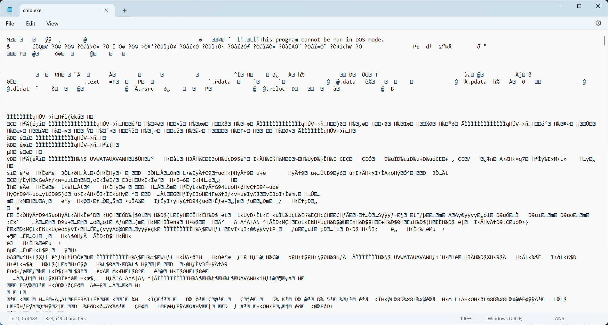
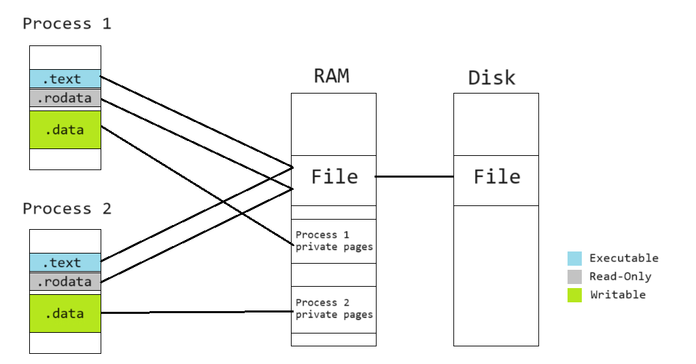
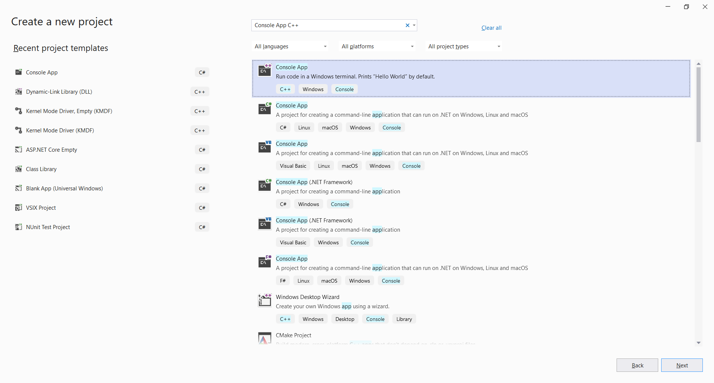
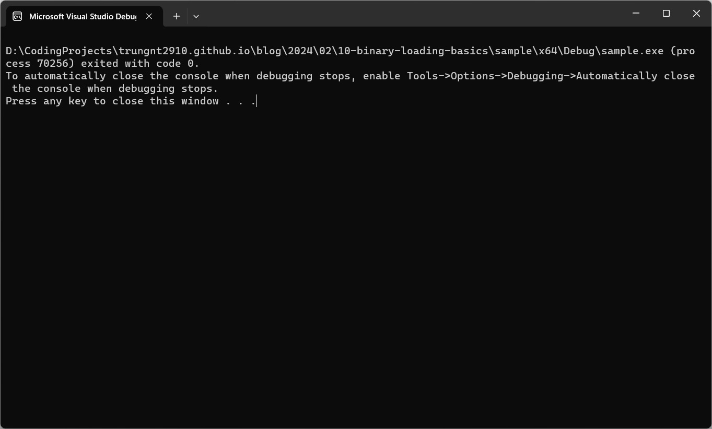

Đã bảo giờ bạn hỏi, "Làm thế quái nào hệ điều hành có thể đọc và hiểu các tệp chương trình?" không?
Mở những tệp kiểu như `.exe` trong trình soạn thảo, mình chỉ thấy chi chít những dòng chữ dường như
vô nghĩa mà nhỉ?



Bài viết này sẽ giải đáp mọi thắc mắc của bạn.

<!-- truncate -->

## Điều kiện

- Hiểu biết cơ bản về ngôn ngữ lập trình C++ và cách dùng công cụ theo dòng lệnh.
- Một môi trường phát triển ứng dụng bằng C/C++ cho Windows. Mình khuyên dùng
[Visual Studio](https://learn.microsoft.com/en-us/cpp/build/vscpp-step-0-installation).
- Các công cụ `nasm`,　`gcc`, và `objdump`. Chúng có thể được cài trên mọi phiên bản Linux, bao gồm
các bản chạy trên [WSL](https://learn.microsoft.com/en-us/windows/wsl/setup/environment).

## Có gì trong một tệp chương trình

Một tệp chương trình (_excecutable file_) là một tệp lưu trữ chương trình máy tính.

Như đã được học, một chương trình gồm hai phần: **lệnh** (_code_) và **dữ liệu** (_data_). Hai thứ
này cũng là những gì trong một tệp chương trình.

Ngoài ra, các tệp chương trình còn gồm các hướng dẫn giúp hệ điều hành chuẩn bị phần lệnh và dữ
liệu, hầu hết nằm trong các "đầu mục vùng" (_section headers_). Bạn có thể sử dụng công cụ
`objdump` để khám phá những đầu mục đó:

```
trung@DESKTOP-5OCA2N2:~$ objdump -h /bin/bash

/bin/bash:     file format elf64-x86-64

Sections:
Idx Name          Size      VMA               LMA               File off  Algn
  0 .interp       0000001c  0000000000000318  0000000000000318  00000318  2**0
                  CONTENTS, ALLOC, LOAD, READONLY, DATA
  1 .note.gnu.property 00000030  0000000000000338  0000000000000338  00000338  2**3
                  CONTENTS, ALLOC, LOAD, READONLY, DATA
  2 .note.gnu.build-id 00000024  0000000000000368  0000000000000368  00000368  2**2
                  CONTENTS, ALLOC, LOAD, READONLY, DATA
  3 .note.ABI-tag 00000020  000000000000038c  000000000000038c  0000038c  2**2
                  CONTENTS, ALLOC, LOAD, READONLY, DATA
  4 .gnu.hash     00004cb8  00000000000003b0  00000000000003b0  000003b0  2**3
                  CONTENTS, ALLOC, LOAD, READONLY, DATA
  5 .dynsym       0000f168  0000000000005068  0000000000005068  00005068  2**3
                  CONTENTS, ALLOC, LOAD, READONLY, DATA
  6 .dynstr       0000a143  00000000000141d0  00000000000141d0  000141d0  2**0
                  CONTENTS, ALLOC, LOAD, READONLY, DATA
  7 .gnu.version  0000141e  000000000001e314  000000000001e314  0001e314  2**1
                  CONTENTS, ALLOC, LOAD, READONLY, DATA
  8 .gnu.version_r 000000f0  000000000001f738  000000000001f738  0001f738  2**3
                  CONTENTS, ALLOC, LOAD, READONLY, DATA
  9 .rela.dyn     0000e2e0  000000000001f828  000000000001f828  0001f828  2**3
                  CONTENTS, ALLOC, LOAD, READONLY, DATA
 10 .rela.plt     000014b8  000000000002db08  000000000002db08  0002db08  2**3
                  CONTENTS, ALLOC, LOAD, READONLY, DATA
 11 .init         0000001b  000000000002f000  000000000002f000  0002f000  2**2
                  CONTENTS, ALLOC, LOAD, READONLY, CODE
 12 .plt          00000de0  000000000002f020  000000000002f020  0002f020  2**4
                  CONTENTS, ALLOC, LOAD, READONLY, CODE
 13 .plt.got      00000030  000000000002fe00  000000000002fe00  0002fe00  2**4
                  CONTENTS, ALLOC, LOAD, READONLY, CODE
 14 .plt.sec      00000dd0  000000000002fe30  000000000002fe30  0002fe30  2**4
                  CONTENTS, ALLOC, LOAD, READONLY, CODE
 15 .text         000e573a  0000000000030c00  0000000000030c00  00030c00  2**4
                  CONTENTS, ALLOC, LOAD, READONLY, CODE
 16 .fini         0000000d  000000000011633c  000000000011633c  0011633c  2**2
                  CONTENTS, ALLOC, LOAD, READONLY, CODE
 17 .rodata       00019df0  0000000000117000  0000000000117000  00117000  2**5
                  CONTENTS, ALLOC, LOAD, READONLY, DATA
 18 .eh_frame_hdr 0000492c  0000000000130df0  0000000000130df0  00130df0  2**2
                  CONTENTS, ALLOC, LOAD, READONLY, DATA
 19 .eh_frame     0001c358  0000000000135720  0000000000135720  00135720  2**3
                  CONTENTS, ALLOC, LOAD, READONLY, DATA
 20 .init_array   00000008  00000000001529b0  00000000001529b0  001529b0  2**3
                  CONTENTS, ALLOC, LOAD, DATA
 21 .fini_array   00000008  00000000001529b8  00000000001529b8  001529b8  2**3
                  CONTENTS, ALLOC, LOAD, DATA
 22 .data.rel.ro  00002b20  00000000001529c0  00000000001529c0  001529c0  2**5
                  CONTENTS, ALLOC, LOAD, DATA
 23 .dynamic      00000200  00000000001554e0  00000000001554e0  001554e0  2**3
                  CONTENTS, ALLOC, LOAD, DATA
 24 .got          00000920  00000000001556e0  00000000001556e0  001556e0  2**3
                  CONTENTS, ALLOC, LOAD, DATA
 25 .data         000087b0  0000000000156000  0000000000156000  00156000  2**5
                  CONTENTS, ALLOC, LOAD, DATA
 26 .bss          0000afb0  000000000015e7c0  000000000015e7c0  0015e7b0  2**5
                  ALLOC
 27 .gnu_debuglink 00000034  0000000000000000  0000000000000000  0015e7b0  2**2
                  CONTENTS, READONLY
```

Hay chúng ta có thể sử dụng công cụ này trên một tệp chương trình Windows

```
trung@DESKTOP-5OCA2N2:~$ objdump -h /mnt/c/Windows/System32/cmd.exe

/mnt/c/Windows/System32/cmd.exe:     file format pei-x86-64

Sections:
Idx Name          Size      VMA               LMA               File off  Algn
  0 .text         0003463d  0000000140001000  0000000140001000  00001000  2**4
                  CONTENTS, ALLOC, LOAD, READONLY, CODE
  1 .rdata        00009602  0000000140036000  0000000140036000  00036000  2**4
                  CONTENTS, ALLOC, LOAD, READONLY, DATA
  2 .data         00001000  0000000140040000  0000000140040000  00040000  2**4
                  CONTENTS, ALLOC, LOAD, DATA
  3 .pdata        00002568  000000014005c000  000000014005c000  00041000  2**2
                  CONTENTS, ALLOC, LOAD, READONLY, DATA
  4 .didat        000000a8  000000014005f000  000000014005f000  00044000  2**2
                  CONTENTS, ALLOC, LOAD, DATA
  5 .rsrc         000084f8  0000000140060000  0000000140060000  00045000  2**2
                  CONTENTS, ALLOC, LOAD, READONLY, DATA
  6 .reloc        000001d0  0000000140069000  0000000140069000  0004e000  2**2
                  CONTENTS, ALLOC, LOAD, READONLY, DATA
```

Chú ý một số ghi chú gắn vào các vùng:
- `CODE`: Vùng này chứa mã máy của chương trình.
- `DATA`: Vùng này chứa dữ liệu.
- `READONLY`: Vùng này nên là vùng chỉ đọc. Ghi chú này thường có trong hầu hết các vùng mã máy và
một số vùng chứa dữ liệu bất biến.

Ngoài ra, chú ý một số tên vùng thường thấy:
- `.text`: Một vùng chỉ đọc, thường chứa mã chương trình.
- `.data`: Một vùng chứa dữ liệu, thường có thể viết được. Trong tệp, vùng này lưu trữ giá trị ban
đầu của các biến.
- `.rodata` or `.rdata`: Một vùng chứa dữ liệu bất biến, chỉ đọc được.

## Định dạng ELF

Xem kỹ ví dụ của `/bin/bash` ở phía trên, ta có thể thấy định dạng tệp (_file format_) là
`elf64-x86-64`. ELF (viết tắt cho **E**xecutable **L**inkable **F**ormat) là một định dạng chương
trình phổ thông nhất, được dùng trong hầu hết các hệ điều hành trừ Windows (sử dụng định dạng
**P**ortable **E**xecutable) và macOS (sử dụng Mach-O).


Mặc dù định dạng này có vẻ phức tạp với một loạt thông tin có ích trong các tình huống khác nhau,
để tạo trình đọc đầu tiên, chúng ta chỉ cần quan tâm đến các phần sau.

### Đầu mục tệp (File header)

Bao gồm thông tin chung về tệp. Nằm ở ngay đầu tệp chương trình.

- `e_ident[EI_MAG0]` đến `e_ident[EI_MAG3]`: "Số thần" (_magic number_) của định dạng ELF: `0x7F`,
`'E'`, `'L'`, `'F'`. 4 _byte_ này được sử dụng để xác thực rằng tệp này đúng là tệp định dạng ELF.
- `e_entry`: Điểm khởi đầu (_entry point_). Đây là con trỏ đến hàm bắt đầu của chương trình.
- `e_phoff`: Con trò đến các đầu mục chương trình (_program headers_), so với vị trí bắt đầu của
tệp.
- `e_phnum`: Số lượng đầu mục chương trình.

### Đầu mục chương trình (Program header)

Gồm các thông tin khác về chương trình được chứa trong tệp.

- `p_type`: Loại đầu mục. Là một trình đọc đơn giản, ta chỉ cần quan tâm đến các đầu mục loại
`PT_LOAD`.
- `p_flags`: Loại bảo vệ bộ nhớ (_memory protection_) cho vùng. Sẽ được giải thích chi tiết trong
các phần sau.
- `p_offset`: Con trỏ đến dữ liệu đầu mục này đại diện cho, so với vị trí bắt đầu của tệp.
- `p_vaddr`: Vị trí trong bộ nhớ mà vùng này cần được lưu vào.
- `p_filesz`: Kích thước của dữ liệu trong tệp gốc. Dữ liệu này sẽ phải được trình đọc chuyển vào
bộ nhớ.
- `p_memsz`: Số _byte_ vùng này chiếm khi trong bộ nhớ. Số này có thể lớn hơn `p_filesz`, trong
trường hợp này hệ điều hành sẽ tự điền số `0` vào phần thừa.

Lú quá? Không lo, tất cả mọi thứ sẽ rõ hơn khi chúng ta bắt tay vào viết trình đọc.

## Ánh xạ vùng nhớ (Memory mappings)

Thông thường, hệ điều hành chạy nhiều tiến trình (_process_) cùng dùng một tệp chương trình, kiểu
như khi người dùng chạy hai cửa sổ `cmd.exe` khác nhau. Trong trường hợp này, việc đọc tệp và chép
dữ liệu vào bộ nhớ được cấp bởi các hàm C++ thông thường sẽ khiến chương trình bị ghi lại nhiều lần
trong RAM.

Để giải quyết vấn đề này, các hệ điều hành có một cơ chể để ánh xạ các trang nhớ vật lý (_physical
page_, vùng nhớ lưu trữ trong RAM) thành các _trang nhớ ảo_ (_virtual pages_, vùng nhớ được đặt
trong miền địa chỉ ảo (_virtual address space_) riêng của mỗi tiến trình). Các trang nhớ vật lý có
thể được thiết đặt để ánh xạ một tệp trên đĩa, hoặc không liên kết với bất kỳ tệp nào.



Để ánh xạ các tệp vào vùng nhớ, trên Windows, ta sử dụng hàm `MapViewOfFile`. Các hệ điều hành khác
có hàm tương tự là `mmap`.

Hơn nữa, để phòng tránh dữ liệu quan trọng bị hủy hoại bởi lỗi lập trình, mỗi trang nhớ ảo thường
được "bảo vệ" bằng một trong những giá trị sau:
- `READ` (Đọc): Có thể đọc trang này.
- `WRITE` (Viết): Có thể viết trang này.
- `EXECUTE` (Tiến hành): Có mã máy trong trang này mà CPU có thể tiến hành.

Cố gắng truy cập (đọc, viết, chạy chương trình) trên một trang ảo mà không được cấp phép quyền
tương ứng sẽ gây ra lỗi truy cập (_access violation_) (thông thường dẫn tới chương trình dừng đột
ngột).

Giá trị `p_flags` trong đầu mục chương trình ELF hướng dẫn trình đọc cấp các quyền tương ứng cho
các trang nhớ chứa dữ liệu sau khi đọc xong. Trên Windows, chúng ta có thể sử dụng hàm
`VirtualProtect` cho thao tác này (`mprotect` trên hầu hết các hệ điều hành khác).

## Xây dựng trình đọc

Để hiểu những phần lý thuyết trên, cùng nhau bắt tay vào làm một trình đọc ELF từ đầu nhé!

Do thực tế đã có quá quá nhiều trình đọc ELF cho Linux và các hệ điều hành UNIX khác, hãy làm một
thứ khác biết chút: Một trình đọc ELF cho Windows.

### Tạo dự án

Khởi động Visual Studio, chọn "Create a new project" trên cột bên phải, và tạo một chương trình
C/C++ mới (_Console App - C++_).



Chú ý, ngôn ngữ của dự án được tạo phải là C++.

### Thêm tệp `elf.h`

Windows không cung cấp sẵn các định nghĩa `struct` cần thiết để xử lý định dạng ELF. Ta cần phải
lấy tệp định nghĩa tại
[đây](https://github.com/trungnt2910/trungnt2910.github.io/raw/master/blog/2024/02/10-binary-loading-basics/sample/elf.h)
và thêm vào dự án.

Tải tệp `elf.h` vào thư mục dự án. Sau đó, từ _Solution Explorer_ (thường nằm bên phải màn hình),
bấm chuột phải vào "Header Files", chọn Add -> Existing Item, rồi chỉ đến tệp định nghĩa mới tải.

### Đọc tệp ELF

Trước tiên, xóa tất cả dòng mẫu trong tệp `.cpp` được tạo sẵn bởi Visual Studio.

Hãy thêm một vài dòng `#include`:

```cpp
// Tránh trình biên dịch cảnh báo khi sử dụng `fopen`
#define _CRT_SECURE_NO_WARNINGS

#include <stdio.h>
#include <vector>
#include <Windows.h>

#include "elf.h"
```

Và thêm một vài `#define` hỗ trợ:

```cpp
// Chọn loại `struct` ELF đúng tùy vào hệ điều hành 32 hay 64 bit.
#ifdef _WIN64
#define ElfW(type) Elf64_##type
#elif defined _WIN32
#define ElfW(type) Elf32_##type
#endif
```

Sau đó, viết hàm `main` của chương trình:

```cpp
int main()
{
    // r: "read" - Đọc
    // b: "binary" - Tệp nhị phân
    // Đặc biệt trên Windows, chúng ta phải nêu rõ chế độ nhị phân.
    // Nếu không, hệ điều hành sẽ thực hiện một số biến đổi hữu ích cho tệp chữ,
    // nhưng phá hỏng dữ liệu của tệp nhị phân.
    FILE* elfFile = fopen("elf", "rb");

    // Đọc đầu mục ELF

    ElfW(Ehdr) header;
    fread(&header, sizeof(header), 1, elfFile);

    if (!IS_ELF(header))
    {
        fprintf(stderr, "Not an ELF file.\n");
        return 1;
    }

    std::vector<ElfW(Phdr)> programHeaders(header.e_phnum);
    fread(programHeaders.data(), sizeof(ElfW(Phdr)), header.e_phnum, elfFile);
}
```

Đến đây, chúng ta đã lấy được đầu mục ELF và đầu mục chương trình (_program headers_). Tiếp theo,
hãy đọc và ánh xạ các vùng dữ liệu.

### Ánh xạ các trang

Trên lý thuyết, các đầu mục chương trình có thể đưa ra bất kỳ quy tắc ánh xạ giữa vùng trong tệp và
trang nhớ ảo. Tuy nhiên, để đơn giản hóa trình đọc của chúng ta, hãy đưa ra một vài giả định
(thường đúng với đa số chương trình ELF sinh ra bởi trình biên dịch):
- Dữ liệu được chỉ bởi đầu mục chương trình vừa ở trong các vùng tệp liên tiếp, vừa cần phải đặt
vào các trang nhớ ảo liên tiếp.
- Đầu mục chương trình đầu tiên chỉ vào đầu của tệp ELF (`p_offset == 0`).
- Hầu hết đầu mục có `p_filesz` bằng `p_memsz`, trừ một vùng cuối với `p_memsz` lớn hơn. Phần cuối
này thường là phần `.data` có thể viết được, khi một bộ phận được khởi tạo trước với dữ liệu và còn
lại được điền `0`.

Biết rằng các đầu mục nằm trong một vùng nhớ ảo liên tiếp, hãy xác định vùng đó dùng một vòng lặp
qua các đầu mục:

```cpp
    // Đọc các đầu mục chương trình và xác định vị trí của tệp chương trình trong bộ nhớ.

    uintptr_t minAddr = -1;
    uintptr_t maxAddr = 0;

    for (const auto& programHeader : programHeaders)
    {
        if (programHeader.p_type != PT_LOAD)
        {
            continue;
        }

        minAddr = min(minAddr, programHeader.p_vaddr);
        maxAddr = max(minAddr, (programHeader.p_vaddr + programHeader.p_memsz));
    }
```

Sau đó, ta có thể làm chút tà đạo Win32 để đặt tệp vào bộ nhớ:

```cpp
    // Lấy một HANDLE Win32 cho tệp

    HANDLE elfFileHandle = CreateFile(L".\\elf",
        GENERIC_READ | GENERIC_EXECUTE,
        FILE_SHARE_READ | FILE_SHARE_WRITE,
        NULL,
        OPEN_EXISTING,
        FILE_ATTRIBUTE_NORMAL,
        NULL);

    // Lấy một HANDLE cho vùng ánh xạ tệp

    HANDLE elfFileMappingHandle = CreateFileMapping(elfFileHandle,
        NULL,
        PAGE_EXECUTE_READ,
        0,
        0,
        NULL);

    // Đặt vùng ánh xạ này vào bộ nhớ

    MapViewOfFileEx(
        elfFileMappingHandle,
        FILE_MAP_READ | FILE_MAP_EXECUTE | FILE_MAP_COPY,
        0, 0,
        maxAddr - minAddr,
        (void*)minAddr
    );
```

Phần đáng chú ý nhất ở đây là cách `CreateFile` được gọi chỉ với quyền đọc/chạy
(`GENERIC_READ | GENERIC_EXECUTE`). Chúng ta không muốn (và có khi không thể) viết bất kỳ dữ liệu
nào về tệp chương trình, khiến cho dữ liệu của tệp bị hỏng. Tuy nhiên, như đã bàn ở trên, một số
phần, như vùng chứa phần `.data`, cần được đặt vào bộ nhớ với quyền đọc/viết. Để tạo một vùng
đọc/viết lưu các thay đổi vào RAM mà không ảnh hưởng đến tệp chương trình gốc, chúng ta thêm
`FILE_MAP_COPY` vào `MapViewOfFileEx` cùng với các tham số quyền khác. Điều này khiến hệ điều hành
sử dụng kỹ thuật chép khi viết
[(_copy-on-write_)](https://en.wikipedia.org/wiki/Copy-on-write#In_virtual_memory_management)
cho vùng nhớ này.

Để hiểu sâu về công dụng của những hàm này, bạn có thể đọc các trang hướng dẫn tương ứng:
- [`CreateFile`](https://learn.microsoft.com/en-us/windows/win32/api/fileapi/nf-fileapi-createfilea)
- [`CreateFileMapping`](https://learn.microsoft.com/en-us/windows/win32/api/winbase/nf-winbase-createfilemappinga)
- [`MapViewOfFileEx`](https://learn.microsoft.com/en-us/windows/win32/api/memoryapi/nf-memoryapi-mapviewoffileex)

### Bảo vệ các trang

Sau `MapViewOfFileEx`, tất cả bộ nhớ mới đặt được cấp phép đọc/viết/chạy. Điều này thường là ngoài
ý muốn do chúng ta hiếm khi cần sửa mã chương trình hay cho CPU chạy vào các vùng chứa dữ liệu.

Để sửa điều này, ta sẽ lặp qua các đầu mục chương trình lại một lần nữa và thiết lập tham số bảo vệ
thích hợp và các vùng nhớ tương ứng bằng hàm
[`VirtualProtect`](https://learn.microsoft.com/en-us/windows/win32/api/memoryapi/nf-memoryapi-virtualprotect).

```cpp
    // Thiết đặt tham số bảo vệ trang

    const auto ElfProtectionToWindows = [](ElfW(Word) elfFlags)
    {
        static const int table[2][2][2] =
        {
            // Không chạy được
            {
                // Không viết được
                { PAGE_NOACCESS, PAGE_READONLY },
                // Viết được
                { PAGE_WRITECOPY, PAGE_WRITECOPY }
            },
            // Chạy được
            {
                // Không viết được
                { PAGE_EXECUTE, PAGE_EXECUTE_READ },
                // Viết được
                { PAGE_EXECUTE_WRITECOPY, PAGE_EXECUTE_WRITECOPY }
            }
        };

        return table[(bool)(elfFlags & PF_X)][(bool)(elfFlags & PF_W)][(bool)(elfFlags & PF_R)];
    };

    for (const auto& programHeader : programHeaders)
    {
        if (programHeader.p_type != PT_LOAD)
        {
            continue;
        }

        unsigned long oldProtect;
        VirtualProtect(
            (void*)programHeader.p_vaddr,
            programHeader.p_memsz,
            ElfProtectionToWindows(programHeader.p_flags),
            &oldProtect
        );
    }
```

Lưu ý rằng `ElfProtectionToWindows` không thể dịch đúng tham số bảo vệ nếu tham số ELF có `PF_W` mà
không có các giá trị khác (hay nói cách khác, vùng chỉ cấp quyền viết, không cấp quyền đọc). Trong
trường hợp này, tham số bảo vệ tương ứng của Windows sẽ cấp quyền đọc/viết. Đây không phải là vấn
đề nghiêm trọng do các vùng chỉ viết rất hiếm, và trong hầu hết các CPU, việc cấp quyền viết cho
một trang nhớ ảo sẽ tự động cấp quyền đọc chính trang đó.

### Nhảy đến vị trí bắt đầu

Với chương trình đã nằm trong bộ nhớ, hãy chạy nó nào!

```cpp
    // `entry`` là con trỏ tới một hàm không nhận tham số và trả về `int`.
    int (*entry)() = (int (*)())header.e_entry;

    return entry();
```

Thông thường, chương trình sẽ không quay lại hàm `main()` sau khi `entry()` được gọi, do đa số
chương trình sẽ có câu lệnh khiến hệ điều hành dừng tiến trình tại cuối hàm bắt đầu. Tuy nhiên, do
chúng ta không thể dùng lệnh hệ thống (_syscall_) `exit` của Linux khi chạy mã trên Windows, ta sẽ
tạo một tệp ELF đặc biệt. Chương trình này sẽ đơn giản là trả về hàm sau khi chạy xong.

## Xây trình ELF thử nghiệm

Đã có trình đọc, giờ chúng ta cùng tạo một chương trình tối giản để thử nghiệm:

```nasm
global _start

section .text
_start:
    mov rax, 0
    ret
```

Trên một máy Linux, biên dịch đoạn hợp ngữ này bằng:

```
nasm -felf64 elf.s -o elf.o
gcc elf.o -o elf -static -nostdlib
```

Nếu không thể tự xây chương trình này, bạn có thể tải xuống ở
[đây](https://github.com/trungnt2910/trungnt2910.github.io/raw/master/blog/2024/02/10-binary-loading-basics/sample/elf).

Chương trình này không làm bất cứ điều gì ngoài trả về một số `0` để báo thành công.

Ở giai đoạn này, ta không thể đưa các chương trình Linux thông thường vào trình đọc của chúng ta
vì:
- Trình đọc của chúng ta không thể xử lý các tệp ELF phức tạp hơn. Những tính năng quan trọng nhất
là điều chỉnh vị trí (_relocation_) và tìm kiếm các tệp chương trình động (_dynamic object
resolution_).
- Chương trình Linux không thể chạy trực tiếp trên Windows do giao diện mã chương trình (ABI -
_Application Binary Interface_) không tương thích. Nói cách khác, Windows thường không có chính xác
những gì các chương trình được xây cho Linux cần.

Sau khi xây, hãy thêm tệp này vào dự án, bằng cách chép nó vào thư mục dự án, bấm chuột phải vào
dự án trong _Solution Explorer_, chọn _Add_ -> _Existing Item_, và chỉ đến tệp tên `elf`.

Mọi thứ sẽ hoạt động trơn chu, và chương trình sẽ trả về 0!



## Kết luận

Làm theo bài viết này, mọi người chắc chắn sẽ viết được một trình đọc ELF của riêng mình rồi chứ,
hay thậm chí có thể làm cho những định dạng khác mình yêu thích như PE và Mach-O (chúng hơi khác,
nhưng vẫn theo những nguyên lý chung).

Dự án mẫu được đăng
[trên GitHub](https://github.com/trungnt2910/trungnt2910.github.io/tree/master/blog/2024/02/10-binary-loading-basics/sample).

Nếu mọi người thích trang của mình và muốn mình mở rộng chủ đề này hơn trong tương lai, hoặc có bất
kỳ ý tưởng đóng góp nào, cho mình xin một lời bình luận nhé.

Hãy đón xem những bài hướng dẫn tiếp theo của mình! Trong thời gian này, hãy xem một số tài liệu
hữu ích dưới đây (nếu bạn không ngại tiếng Anh!):
- [Wikipedia - Executable and Linkable Format](https://en.wikipedia.org/wiki/Executable_and_Linkable_Format)
- [Microsoft Learn - File Mapping](https://learn.microsoft.com/en-us/windows/win32/memory/file-mapping)
- [HelloElf](https://github.com/trungnt2910/HelloElf) - Một lần thử nghiệm một chương trình đọc và
chạy tệp ELF viết cho x86_64 Linux trên Windows. Bao gồm một trình đọc ELF tương tự, đồng thời có
thêm trình giả lập cơ bản cho một phần của ABI Linux.
