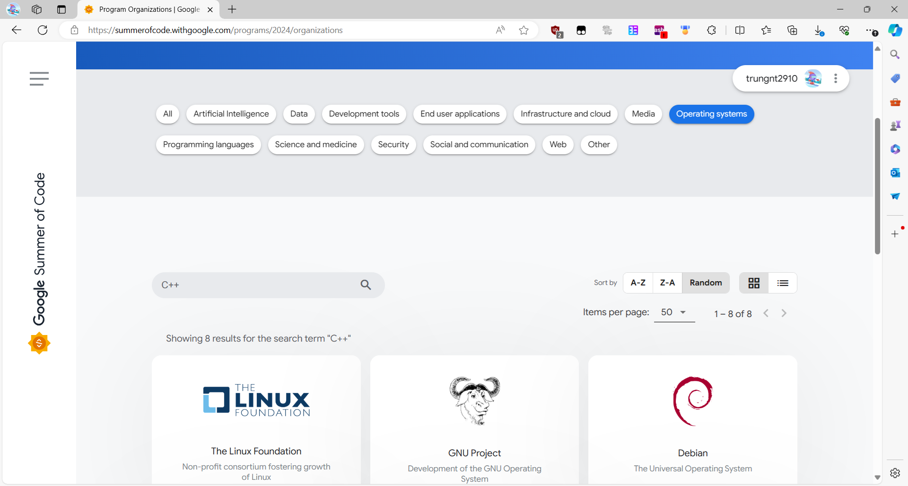
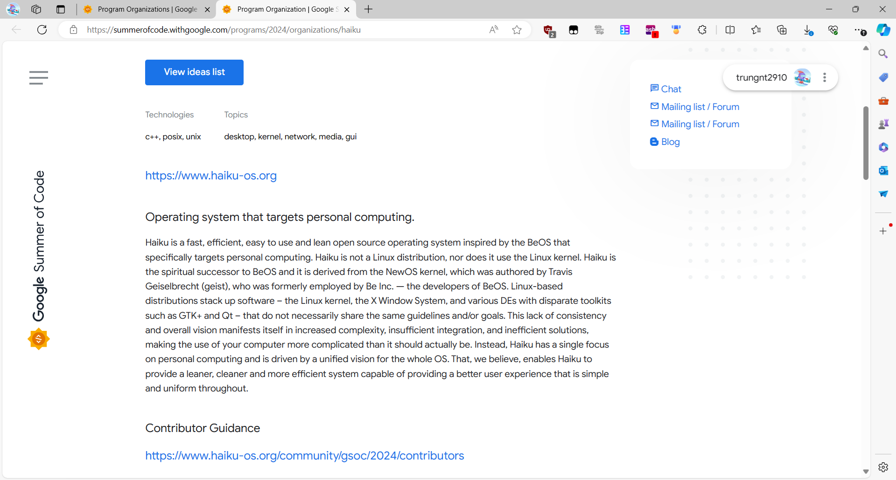
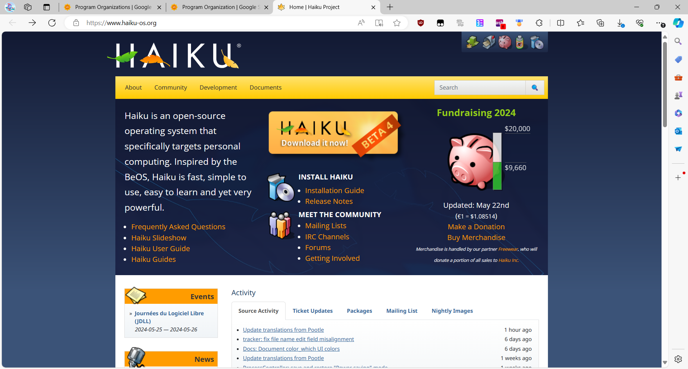
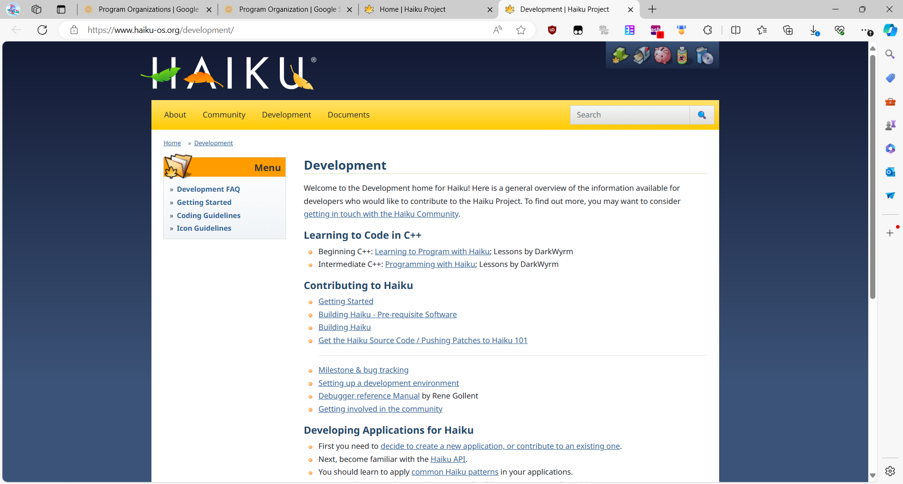
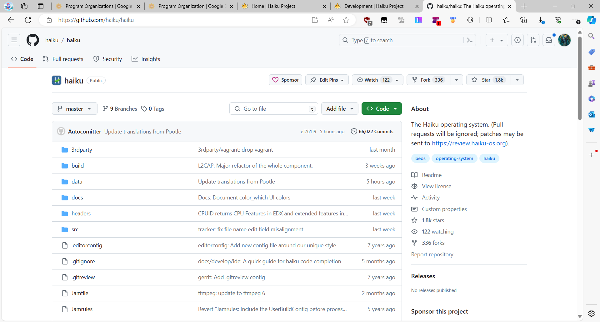
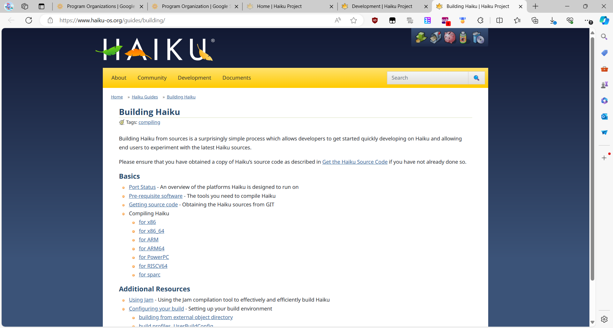
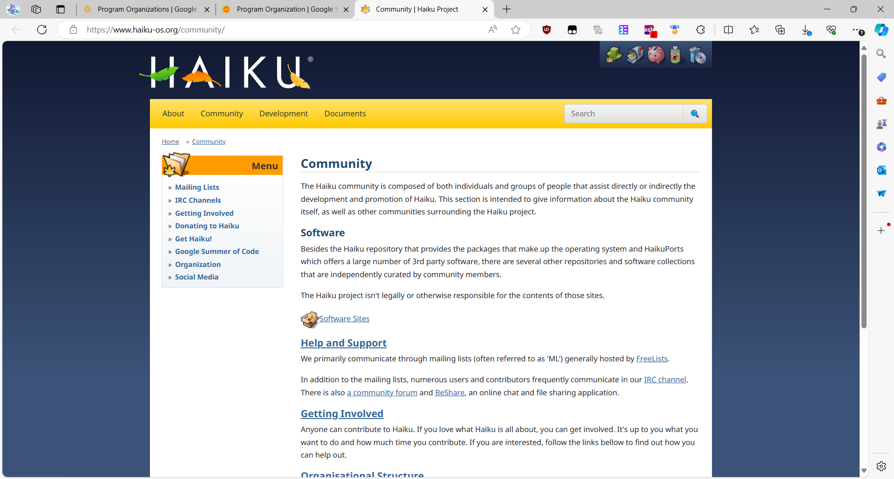
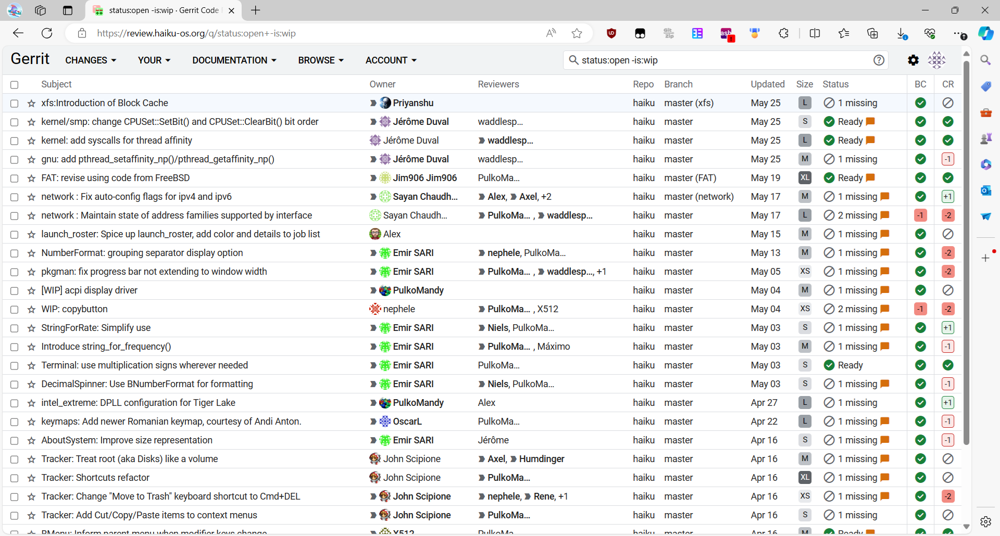
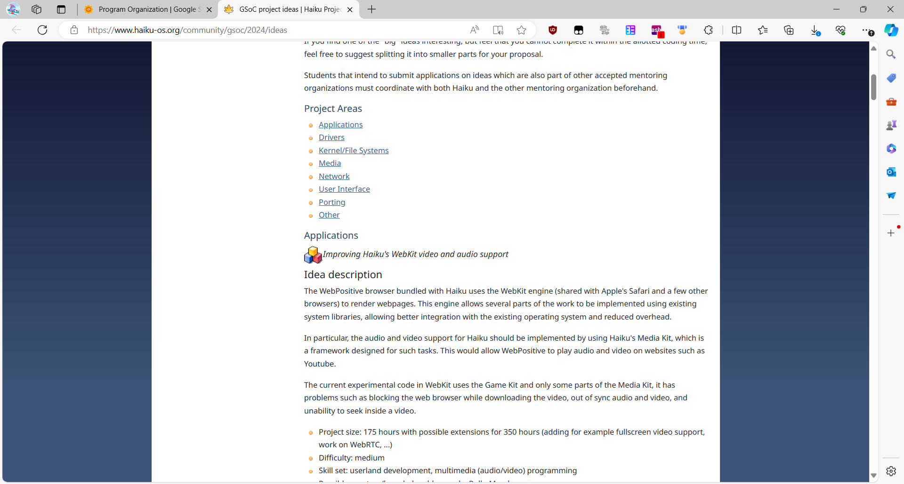

<head>
    <meta property="og:image" content={require('./gsoc_light.png').default} />
    <meta name="twitter:image" content={require('./gsoc_light.png').default} />
</head>

Bạn là sinh viên công nghệ thông tin có **đam mê** với lập trình?

Bạn muốn tham gia các dự án với các **tổ chức lớn** trên thế giới để có thểm kinh nghiệm?

Bạn cần thêm **vài đồng** để trang trải cuộc sống nhưng muốn làm gì có ý nghĩa hơn?

Có thể **Google Summer of Code** là một lựa chọn tuyệt vời. Hãy cùng mình khám phá thêm về chương
trình này nhé. Là một người đã trúng tuyển 2 năm, mình cũng sẽ chia sẻ **con đường chinh phục** GSoC
của mình.

    

    

<!-- truncate -->

## Google Summer of Code

### Google Summer of Code là gì?

Google Summer of Code (thường viết tắt là GSoC), là một chương trình do Google tổ chức nhằm khích lệ
học sinh, sinh viên, và những người mới lập trình tham gia vào các dự án phần mềm _mã nguồn mở_.

Hàng năm, Google sẽ làm việc với nhiều tổ chức lớn nhỏ khắp thế giới để kết nối sinh viên với những
lập trình viên có kinh nghiệm (các _mentor_). Những sinh viên này sẽ được hướng dẫn để thực hiện
những ý tưởng do chính họ đưa ra trong các đề án trong vòng 3 tháng (12 tuần) hè.

Trong suốt quá trình này, tùy vào nơi cư trú và cỡ dự án, các bạn có thể nhận một khoản
[tiền thưởng](https://developers.google.com/open-source/gsoc/help/student-stipends). Ở Việt Nam,
mức này là **$3000** cho một dự án lớn, nhưng các nơi khác có thể lên đến **$6600**. Các bạn du học
sinh sẽ đặc biệt có lợi - ví dụ như mình đang ở Úc thì sẽ được trả theo mức tối đa.

Ngoài ra, quá trình thực hiện dự án sẽ giúp các bạn va chạm với rất nhiều chuyên gia trong ngành.
Những mối quan hệ và kinh nghiệm này sẽ cho bạn lợi thế lớn khi xin việc, ít nhất là trong
vòng duyệt hồ sơ.

### Google Summer of Code KHÔNG là gì?

#### Chương trình thực tập tại Google

Điều mà mọi người hay hiểu nhầm là GSoC là một chương trình thực tập tại Google hay một cơ hội làm
việc tại Google.

Trong suốt GSoC, bạn chỉ làm việc với tổ chức mã nguồn mở bạn đăng ký cùng, **không** làm việc trong
Google hay với Google. Google chỉ là bên đứng ra kết nối và tài trợ.

Vì vậy, bạn không thể nhận là đã từng làm việc cho Google. Tuy nhiên, kinh nghiệm làm việc trong kỳ
GSoC sẽ rất hữu ích khi đưa vào hồ sơ xin việc cho các công ty khác hay khi nêu ra trong các buổi
phỏng vấn, đặc biệt đối với những bạn mới ra trường ít có cơ hội làm việc thực tế.

#### Kỳ thi

GSoC **không phải là một kỳ thi**.

Sẽ có một sự cạnh tranh lớn trong vòng ý tưởng. Tuy nhiên, khác với những cuộc thi thông thường,
những đề án được chấp nhận không phải những gì quá độc đáo hay cao siêu, mà là những gì thiết thực
nhất với cộng đồng mã nguồn mở. Trong vòng này, bạn nên thảo luận với các tổ chức (vì chính các tổ
chức sẽ duyệt đề án của bạn) và chủ động xin ý kiến của cộng đồng xung quanh sản phẩm đó, thay vì
giữ bí mật đơn nộp của mình. Mình sẽ nói thêm về điều này ở những phần sau.

Ở vòng lập trình, sẽ có những bài đánh giá (_evaluation_), nhưng nó hoàn toàn dựa trên tiến độ công
việc của bạn và không hề so sánh với ai. Việc hợp tác và thảo luận là thiết yếu với mọi dự án, và
cũng là tinh thần chung của lập trình mã nguồn mở.

#### Công việc ổn định

Đây là một trải nghiệm hướng tới sinh viên mới làm quen với lập trình hơn là một cơ hội kiếm tiền.
Vì vậy, Google chỉ cho phép một người tham gia **tối đa 2 chương trình**.

Tuy nhiên, tùy vào tổ chức, những bạn đã hoàn thành GSoC thường có nhiều cơ hội gắn bó lâu dài, thậm
chí một số ít còn nhận được việc làm tại hay liên quan đến tổ chức đó.

## Lập trình Mã nguồn mở - Open Source

Cốt lõi của mỗi dự án GSoC là mã nguồn mở (_Open Source_). Đây cũng là một từ khóa nóng trong giới
công nghệ những năm gần đây, nên hãy cùng mình tìm hiểu nhé.

### Tổng quan

Mã nguồn mở là một khái niệm chỉ những dự án có _mã nguồn_ công khai. Sự công khai này giúp cho mọi
người có thể dễ dàng chia sẻ, tái sử dụng, và chỉnh sửa một sản phẩm phần mềm. Mô hình mở này cũng
tạo điều kiện cho cả cộng đồng cùng nhau đóng góp và phát triển dự án đó, thay vì dựa vào một vài cá
nhân hay doanh nghiệp.

### Cách hoạt động

Hầu hết các dự án mã nguồn mở đều do những cá nhân tình nguyện hoặc các tổ chức phi lợi nhuận duy
trì. Họ thường hoạt động vì đam mê hoặc dựa vào những đồng quyên góp của cộng đồng.

Một số dự án có tầm ảnh hưởng cũng có thể được các doanh nghiệp lớn hậu thuẫn. Điển hình là Android
của Google hay .NET của Microsoft. Những công ty này có thể được khách hàng trả tiền để duy trì hay
hỗ trợ việc triển khai, hoặc cũng có thể trực tiếp sử dụng những dự án đó trong nhiều sản phẩm cốt
lõi khác.

Nhiều dự án, ngoài việc công khai mã nguồn, còn khuyến khích mọi người đóng góp trên các nền tảng
như [GitHub](https://github.com). Bất kỳ ai đều có thể góp ý (mở một _Issue_) hay đề xuất một thay
đổi trong mã nguồn (mở _Pull Request_) để sửa lỗi hay thêm tính năng mới.

### Lợi ích

Các dự án mã nguồn mở là nơi mọi người khắp nơi trên thế giới có thể kết nối, chia sẻ kiến thức, và
hợp tác.

Ngoài ra, tạo và duy trì những dự án mã nguồn mở cũng là một cách sinh viên chúng mình có thể vừa
ứng dụng kiến thức, vừa quảng bá bản thân trong cộng đồng. Hoạt động mã nguồn mở cũng là những bằng
chứng cho năng lực của bản thân trong hồ sơ xin việc sau này.

### Những điều nên tránh

Gần đây, với sự nóng lên của phong trào mã nguồn mở, hay do những hoạt động khích lệ mã nguồn mở như
[Hacktoberfest](https://hacktoberfest.com) hay chính GSoC, ngày càng nhiều bạn đang học lập trình
bắt đầu "đu _trend_", mở các _Issue_ hay _Pull Request_ trên GitHub.

Thường thì mọi đóng góp đều có ích, nhưng nếu các bạn không chịu tìm hiểu về dự án và tổ chức mà vẫn
đưa ra những câu hỏi "ngu" hay mở những _Pull Request_ "rác", những người duy trì dự án (thường là
những tình nguyện viên) sẽ cảm thấy rất mệt mỏi và khó chịu, ảnh hướng xấu đến sự phát triển của sản
phẩm.

Các bạn hãy lưu ý điều này khi chuẩn bị cho GSoC. Hãy chỉ đóng góp vào mã nguồn mở khi mình thực sự
có đam mê hay sử dụng một phần mềm nào đó, tránh tham gia mã nguồn mở chỉ vì lợi ích của chương
trình.

## Cách đăng ký Google Summer of Code

Nắm được thông tin cơ bản về mã nguồn mở nói chung và GSoC nói riêng, chúng ta có thể bắt đầu hành
trình này!

Tuy GSoC là một chương trình 18+ (vì là việc có lương nên phải đủ 18 tuổi mới được tham gia), nhưng
mình khuyên những bạn có tham vọng hãy tìm hiểu từ những năm THPT, hoặc **ít nhất 1 - 2 năm** trước
khi đăng ký.

### Tìm tổ chức

Trước khi làm một đề án, chúng ta phải tìm một tổ chức. Để tìm được tổ chức phù hợp, trước tiên hãy
tự hỏi bản thân một vài câu sau đây.

#### Mình đam mê mảng gì?

Khoa học máy tính, công nghệ thông tin là những mảng rất rộng, có rất nhiều phần ngành khác nhau.
Một số ví dụ ở đây là trí tuệ nhân tạo (_Artificial Intelligence_), phân tích dữ liệu (_Data_),
bảo mật (_Security_), ứng dụng mạng (_Web_),...

Bản thân mình thì từ nhỏ đã nghịch nhiều hệ điều hành của các thiết bị khác nhau (từ Windows,
Android cho đến Linux) nên ngay từ đầu đã ngắm tới những tổ chức làm về hệ điều hành
(_Operating Systems_).

#### Mình mạnh ở những công nghệ nào?

Trong mỗi mảng sẽ có nhiều tổ chức khác nhau. Mỗi tổ chức sẽ có một hệ sinh thái các sản phẩm liên
quan sử dụng những ngôn ngữ và nền tảng khác nhau.

Xuất phát từ mảng lập trình thi đấu trong những năm THPT, thế mạnh của mình có lẽ là C++.

Xác định được những điều này, các bạn có thể bắt đầu tìm kiếm tổ chức trên
[trang của GSoC](https://summerofcode.withgoogle.com/programs/2024/organizations):

Trên trang, bạn có thể tìm kiếm các tổ chức theo mảng và theo ngôn ngữ lập trình hay loại công nghệ
sử dụng. Khi thấy một tổ chức nào hấp dẫn, bạn có thể nhấn chuột vào để tìm hiểu thêm, ví dụ như
Haiku, tổ chức mình đã chọn:

Chú ý rằng, mỗi năm danh sách tổ chức sẽ khác nhau. Đường dẫn của mình chỉ đến danh sách của
năm 2024. Bạn có thể truy cập danh sách của các năm khác bằng cách thay thế số `2024`, ví dụ như:
- 2023: [https://summerofcode.withgoogle.com/programs/2023/organizations](https://summerofcode.withgoogle.com/programs/2023/organizations)
- 2022: [https://summerofcode.withgoogle.com/programs/2022/organizations](https://summerofcode.withgoogle.com/programs/2022/organizations)

Nếu bạn không đăng ký ngay trong kỳ sắp tới, mình khuyên các bạn nên lựa chọn những tổ chức đã xuất
hiện trong nhiều năm qua.

### Làm quen

Sau khi đã tìm được một (hoặc một _vài_!) tổ chức ưng ý, bạn có thể bắt đầu làm quen với họ.

#### Trải nghiệm sản phẩm

Điểm xuất phát tốt nhất là trang chủ của dự án. Thông thường sẽ có một đường dẫn đến trang này từ
trang thông tin trên GSoC. Ví dụ như với [Haiku](https://haiku-os.org):

Trên trang chủ sẽ có tổng quan về dự án và hướng dẫn cài đặt. Các bạn nên cài đặt chương trình vào
máy của mình.

Trong quá trình tải và cài đặt, các bạn cũng nên tìm hiểu thêm về dự án qua các
[bài viết của tổ chức](https://www.haiku-os.org/blog/) hay những trang ngoài như
[Wikipedia](https://en.wikipedia.org/wiki/Haiku_(operating_system)).

#### Làm quen với mã nguồn

Tiếp theo, các bạn sẽ cần phải làm quen với mã nguồn - thứ mà bạn sẽ phải làm việc với trong suốt
quá trình GSoC.

##### Tìm mã nguồn

Mỗi tổ chức sẽ có một cách phân phối mã nguồn riêng. Thường thì bạn có thể tìm hiểu cách lấy mã
nguồn trên trang dự án của họ. Bạn có thể tìm phần này trong mục "_Source_", "_Code_",
"_Development_", hay "_Contributing_", tùy vào tổ chức. Ví dụ như với Haiku, bạn có thể vào đường
dẫn [_Development_](https://www.haiku-os.org/development/) từ trang chủ:

Trong những bài viết này, có một bài
[_Get the Haiku Source Code_](https://www.haiku-os.org/guides/building/get-source-git/)
hướng dẫn các bạn tải mã nguồn về.

Lưu ý rằng, một số tổ chức có thể có nhiều dự án nhỏ, mỗi dự án đó có thể có một bộ mã nguồn khác
nhau. Các bạn nên đọc kỹ hướng dẫn để tải đúng bộ.

Ngoài ra, các tổ chức còn hay đăng mã nguồn các dự án của mình trên [GitHub](https://github.com),
một trang "mạng xã hội" lớn dành cho những nhà phát triển phần mềm. Bạn có thể tìm ra trang mã
nguồn trên GitHub bằng cách tra Google `<tên dự án> source code GitHub`. Ví dụ như Haiku:

GitHub có thể không phải là nơi làm việc chính của một số tổ chức, nhưng là một chỗ rất tiện lợi để
tra cứu và đọc mã nguồn sau này.

##### Xây dựng mã nguồn

Có được mã nguồn, mọi người sẽ phải thực hiện một số "ma thuật" để biến chúng thành sản phẩm sử dụng
được.

Mỗi dự án sẽ sử dụng những công cụ và quy trình đặc thù trong quá trình phát triển. Thường chúng sẽ
nằm ở tệp `README.md` trong mã nguồn, ở một mục "_Development_", "_Building_", hay "_Compiling_".
Với Haiku, bạn có thể tham khảo tệp `ReadMe.Compiling.md` trong mã nguồn.

Ngoài ra trên trang dự án thường cũng có hướng dẫn dành cho cộng đồng nhà phát triển:

#### Làm quen với cộng đồng

Với những dự án phức tạp, trong quá trình sử dụng hay xây dựng mã nguồn sẽ không thể tránh khỏi
những vướng mắc. Đây sẽ là lúc chúng mình có thể nhờ sự trợ giúp của cộng đồng mã nguồn mở.

Ngoài ra, việc tham gia những cộng đồng khi đã hiểu về dự án cũng giúp mọi người thể hiện nguyện
vọng đóng góp và cũng một cách nào đó khéo léo quảng bá khả năng học hỏi và lập trình của bản thân.
Những hoạt động trong cộng đồng của các bạn sẽ giúp xây dựng uy tín, tạo ra một lợi thế khi đăng ký
GSoC sau này.

##### Tìm kênh liên lạc

Mỗi cộng đồng mã nguồn mở sẽ có kênh liên lạc khác nhau, bao gồm:
- Diễn đàn (_forum_).
- Nhóm trò chuyện (_chat room_).
- Danh sách thư (_mailing list_). Đây là một địa chỉ email, khi bạn gửi vào địa chỉ này, tất cả
những người đăng ký vào danh sách thư sẽ nhận được thư của bạn.

Thông tin này thường sẽ có trên đầu phía bên phải mỗi trang giới thiệu dự án trên GSoC. Ngoài ra,
bạn cũng có thể vào trang chủ dự án rồi truy cập mục _Community_.

##### Văn hóa hỏi

Các cộng đồng mã nguồn mở thường rất thoải mái và đón chào những câu hỏi từ những bạn mới bắt đầu.
Tuy nhiên, để tránh tạo ra ấn tượng xấu, mọi người nên lưu ý vài điều:
- Để tránh mất thời gian của nhau, trước khi hỏi câu hỏi, các bạn nên **tìm hiểu kỹ vấn đề**. Hãy
đọc kỹ các tài liệu và tra các diễn đàn xem ai đã hỏi tương tự chưa. Khi hỏi, hãy nêu kỹ tình huống,
những điều bạn đã làm, và cách mọi người có thể dựng lại vấn đề của bạn để nghiên cứu và giải đáp.
- Các tổ chức lớn thường sẽ được chia thành nhiều kênh dựa trên sản phẩm, ngôn ngữ giao tiếp,... Chú
ý đọc kỹ nội quy và đăng câu hỏi vào đúng kênh.
- Những người trên diễn đàn thường nhiệt tình, những cũng chỉ là tình nguyện viên cống hiến trong
thời gian rảnh. Họ không có nghĩa vụ phải trả lời tất cả các câu hỏi ngay lập tức. Sẽ là điều rất
**bình thường nếu không ai trả lời** câu hỏi của bạn, đặc biệt khi đó là vấn đề khó, chuyên sâu.
Tránh lạm dụng tính năng gắn thẻ hay liên tục gửi tin nhắn để giục ai đó trả lời.

#### Những đóng góp đầu tiên

Trong quá trình cài đặt và sử dụng các phần mềm, các bạn sẽ gặp không ít trục trặc, đặc biệt với
những dự án đang phát triển nhanh.

Những trục trặc này chính là cơ hội để các bạn đóng góp lại cho dự án. Những đóng góp này không cần
là gì cao siêu, mà có thể chỉ là thêm
[vài dòng định nghĩa](https://review.haiku-os.org/c/haiku/+/6718/2/headers/os/interface/Alert.h) bị
thiếu ở một tệp nào đó. Ngoài ra, bạn cũng có thể viết thêm tài liệu cho dự án, giải thích nguyên
nhân và cách khắc phục những lỗi bạn đã gặp.

Chú ý làm quen với nền tảng làm việc của dự án trước khi đóng góp. Thường nội dung này sẽ được giải
thích kỹ trên trang mạng hay trong mã nguồn dưới mục _Contributing_. Nhiều tổ chức làm việc trên
GitHub, nhưng số còn lại như [Haiku](https://review.haiku-os.org) làm việc trên một số nền tảng đặc
thù.

Hơn nữa, hãy đảm bảo rằng mỗi đóng góp của mình mang một ý nghĩa nhất định: Để giải quyết vấn đề hay
thêm tính năng phù hợp với định hướng phát triển của dự án. Tránh sửa những lỗi vặt như thêm dấu
cách, sửa lỗi chính tả,... Những "đóng góp" này không chứng tỏ được khả năng chuyên môn của bạn,
không giúp bạn học thêm điều gì, mà còn làm mất thời gian của những người duy trì dự án.

### Ý tưởng

Khi đã làm quen với tổ chức và hòa nhập vào cộng đồng, giờ đến lúc chúng ta nghĩ ra ý tưởng để
chuẩn bị cho GSoC.

#### Danh sách ý tưởng

Trên mỗi trang giới thiệu tổ chức của GSoC là một nút rất lớn "_View ideas list_". Nút này sẽ dẫn
chúng ta đến trang danh sách ý tưởng của từng tổ chức.

Những ý tưởng này thường được phân thành các mảng nhỏ để mọi người dễ tìm dự án phù hợp.

Lợi ích của việc chọn ý tưởng từ danh sách là thường các ý tưởng này phù hợp với định hướng phát
triển của dự án. Nếu các bạn làm được đề án tốt, các bạn sẽ dễ nhận được ủng hộ của tổ chức.

Tuy nhiên, không phải lúc nào cũng có một ý tưởng phù hợp nhất với bản thân trong danh sách này.
Hơn nữa, việc chọn ý tưởng theo "sách giáo khoa" cũng khiến bạn phải cạnh tranh với nhiều người làm
đưa ra cùng một đề án trong vòng tuyển. Ví dụ như vào năm 2024, ở tổ chức NetBSD, mình có nộp một
[đề án](https://mail-index.netbsd.org/tech-kern/2024/02/thread1.html) về giả lập Linux, và trong
những [tháng](https://mail-index.netbsd.org/tech-kern/2024/03/thread1.html)
[sau](https://mail-index.netbsd.org/tech-kern/2024/04/thread1.html), có 2 - 3 bạn cũng bày tỏ nguyện
vọng muốn làm về chủ đề đó.

#### Ý tưởng cá nhân

Đây là một lựa chọn của không ít thí sinh tham dự GSoC. Nhiều tổ chức cũng khuyến khích điều này.
Trích từ Haiku:

> The most successful Google Summer of Code projects are often those proposed by the participants
> themselves. The following list represents some of our ideas and wishes for the project.
> However, suggesting your own idea is always encouraged!

Ý tưởng này có thể là bất kỳ điều gì liên quan đến dự án. Bản thân mình sẽ nghĩ ý tưởng theo hai
hướng chính:

##### Kết nối với thế mạnh, sở thích

Đây là cách mình đã có dự án [GSoC năm 2023](https://go.trungnt2910.com/gsoc23). Ngoài hệ điều hành,
mình cũng đam mê và có hiểu biết sâu về nền tảng .NET và ngôn ngữ C#. Việc kết nối .NET với hệ
điều hành Haiku, đem lại ngôn ngữ C# cho cộng đồng Haiku là một lựa chọn hoàn hảo với mình.

Ngoài ra, mình cũng đưa ra một số dự án về giả lập Linux - một thế mạnh khác của mình. Rất tiếc,
mình chưa có mùa GSoC nào thành công từ ý tưởng này.

##### Khắc phục vấn đề thực tế

Đây là nguồn gốc ý tưởng dự án [GSoC năm 2024](https://go.trungnt2910.com/gsoc24) của mình. Suốt
quá trình phát triển phần mềm, việc thiếu đi trình gỡ lỗi (_Debugger_) tốt trên Haiku khiến mình cảm
thấy không hài lòng. Thực tế này cũng đang cản trở nhiều dự án khác của cộng đồng. Vì vậy, đề án
hiện tại của mình nhận được
[nhiều ủng hộ](https://discuss.haiku-os.org/t/gsoc-2024-proposal-improving-the-userland-debugging-experience/14681)
từ tổ chức và cộng đồng.

### Lập đề án

Khi có một ý tưởng xác định, bạn có thể lập một đề án cho GSoC.

Tuy chúng mình có thể nghĩ ý tưởng và tìm hiểu nó từ sớm, nhưng mình khuyên nên để việc viết dự
án vào tầm **đầu tháng 3** của năm bạn ứng tuyển GSoC. Đây là lúc Google công bố các tổ chức tham
gia - tránh trường hợp dành nhiều thời gian cho một đề án với một tổ chức xong tổ chức đó không có
mặt trong năm đó.

Trước khi dành công sức lập đề án, bạn nên hỏi tổ chức và cộng đồng về những ý tưởng của bạn, để xem
liệu chúng có phù hợp. Năm 2023, mình có đưa ra 2 ý tưởng, một ý tưởng nhận được
[nhiều sự ủng hộ](https://discuss.haiku-os.org/t/gsoc-2023-net-port/13237),
ý tưởng còn lại
[gây tranh cãi](https://discuss.haiku-os.org/t/gsoc-2023-alternate-proposal-non-native-binary-execution/13241)
nên mình quyết định không lập đề án nữa.

Lúc này, các bạn có thể nói rõ nguyện vọng của mình là tham gia GSoC. Các bạn cũng có thể đưa ra đề
án để tổ chức và cộng đồng góp ý, chỉnh sửa. Thường các đề án sẽ mang nét riêng của mỗi người, nên
các bạn không nên lo về vấn đề "lộ hàng" khi đăng trên các diễn đàn.

Lưu ý rằng, mỗi tổ chức sẽ có những yêu cầu nhất định về định dạng các đề án. Thường những yêu cầu
này sẽ được đăng cùng danh sách ý tưởng để hướng dẫn những bạn có ý định đăng ký GSoC.

## Sau khi trúng tuyển

Nếu bạn đã đạt được đến bước này, đầu tiên mình xin được gửi lời chúc mừng! Bạn đã được chọn vào một
chương trình có tỉ lệ chọi cao hơn cả kỳ thi đầu vào các trường THPT chuyên ở Hà Nội!

Sau khi trúng tuyển, cả Google và tổ chức bạn đăng ký sẽ gửi cho các bạn rất nhiều nội dung hỗ trợ.
Bạn nên chú ý thường xuyên theo dõi các trang của GSoC, của tổ chức, và hòm thư để nhận được cập
nhật trong suốt chương trình.

Xin được nhắc lại, GSoC không phải là kỳ thi. Chỉ cần niềm đam mê và sự đóng góp thường xuyên là bạn
có thể dễ dàng vượt qua giai đoạn này của chương trình. Hơn nữa, hãy tận dụng tốt môi trường mã
nguồn mở này để kết nối với cộng đồng phát triển ứng dụng trên toàn thế giới.

## Lời kết

Cảm ơn mọi người đã ghé thăm và ủng hộ trang của mình!

Vì đây là một trong những bài viết đầu tiên của mình về một chủ đề khá rộng, bài viết này không thể
tránh được những thiếu sót. Nếu có bất kỳ ý kiến đóng góp nào, mong mọi người hãy gửi mình một bình
luận vào ô dưới đây.

Chúc mọi người thành công trên con đường chinh phục GSoC và lập trình mã nguồn mở!

### Tham khảo thêm

- Vấn đề nhức nhối trong giới mã nguồn mở:
[Video YouTube của Theo - t3.gg](https://www.youtube.com/watch?v=5nY_cy8zcO4).
- Chi tiết về GSoC:
[What is Google Summer of Code?](https://google.github.io/gsocguides/student/index).
- Cách vận hành của GSoC:
[How GSoC Works](https://google.github.io/gsocguides/student/how-gsoc-works).
- Đề án trúng tuyển của mình trong năm 2023:
[.NET Developer Platform port for Haiku](./GSoC_23_Proposal_Haiku_dotnet.pdf).
- Đề án trúng tuyển của mình trong năm 2024:
[Improving the userland debugging experience](./GSoC_24_Proposal_Haiku_Debugging.pdf).
- Đề án _suýt_ trúng tuyển của mình trong năm 2024 (một năm mỗi người chỉ được làm một dự án):
[ARM64 Port for Haiku](./GSoC_24_Proposal_Haiku_arm64.pdf).
