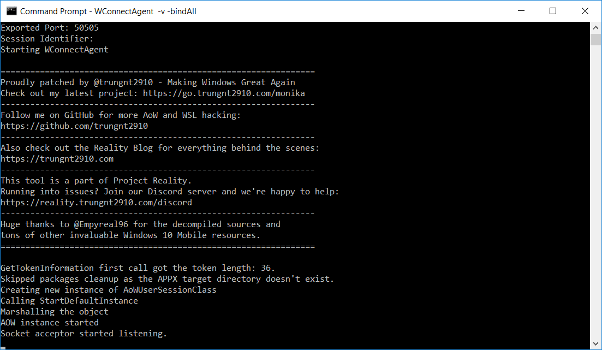
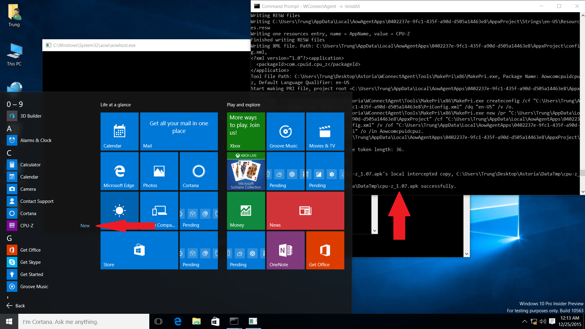
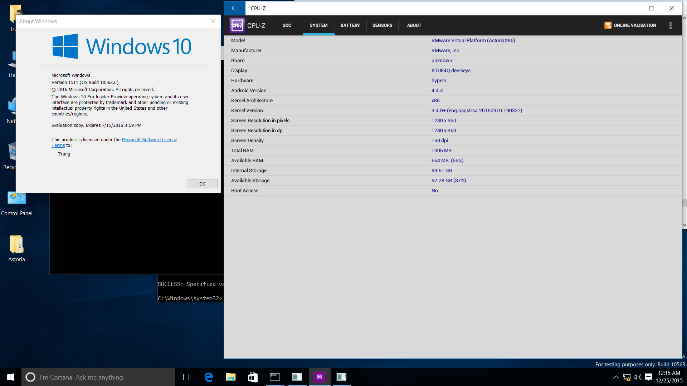

<head>
    <meta property="og:image" content={require('./lost_android.png').default} />
    <meta name="twitter:image" content={require('./lost_android.png').default} />
</head>

Bạn là một "fan cuồng" của Windows 10 Mobile? Bạn nhớ đến một thời Microsoft thử nghiệm "Project
Astoria", một giải pháp đưa ứng dụng Android cho các thiết bị Windows Phone? Hay bạn đơn giản chỉ
quá chán nản với những trình giả lập Android của Tàu, chạy chỉ có "lag" máy?

Bài viết này dành cho bạn. Hãy cùng mình khám phá cách đưa Astoria đến những phiên bản Windows khác,
từ những loại thiết bị khác như Desktop, cho đến những phiên bản mới hơn như bản cập nhật
_Anniversary Update_ (RS1) và sau nữa.

<figure>
    
    <figcaption style={{fontStyle: "italic", textAlign: "center"}}>
        Sinh ra bởi Microsoft Copilot.
    </figcaption>
</figure>

<!-- truncate -->

## Giới thiệu

_Project Astoria_, hay còn được gọi là _Windows Bridge for Android_, là một thí nghiệm cho phép chạy
ứng dụng Android trên những bản dùng thử đầu tiên của Windows 10 Mobile. Tính năng này chỉ có trên
Windows cho điện thoại và bị hủy trước khi Windows 1511 ("Thresold 2") ra mắt.

Giải pháp này bao gồm một chương trình Android 4.4 chạy trên một lớp tương thích (`lxcore.sys`) có
vai trò dịch các _syscall_ - lời gọi hàm hệ thống - Linux do Android đưa ra thành các lời gọi tương
đương cho Windows NT. Cùng với một số chương trình hệ thống khác, Astoria giúp nhiều ứng dụng
Android chạy song song với phần mềm cho Windows và tích hợp mượt mà vào môi trường, không cần phải
chạy một máy ảo nặng như các giải pháp hiện hành.

Tuy chỉ được phát hành cho điện thoại, về lý thuyết, Astoria được thiết kế để hỗ trợ cả những phiên
bản Windows 10 khác. Sau một thời gian bị bỏ xó, dự án này được dùng lại để xây nên _Windows
Subsystem for Linux_, thiết kế cho các chương trình Linux, rồi lại bị lãng quên vào năm 2020, khi
WSL bắt đầu sử dụng giải pháp ảo hóa "trâu bò" dựa trên Hyper-V.

## Điều kiện

- Kỹ năng thiết đặt và chỉnh sửa Windows (VD: Chỉnh sửa Registry, thay thế tệp hệ thống).
- Sử dụng Project Astoria để cài đặt APK trên các phiên bản Windows 10 Mobile được hỗ trợ. Bạn có
thể tham khảo bài hướng dẫn
[này](https://www.wpxbox.com/this-tool-lets-you-run-android-apks-on-windows-10-mobile).

## Chuẩn bị

Là một chương trình phức tạp, Astoria chứa nhiều tệp và cần hệ thống có những tính năng và thiết đặt
nhất định.

<figure>
    
    <figcaption style={{fontStyle: "italic", textAlign: "center"}}>
        Tổng quan về Project Astoria
    </figcaption>
</figure>

### Phiên bản Windows 10

Bài hướng dẫn này được thử nghiệm trên Windows 10 x86 build 10563.

Cũng có thể thực hiện điều này trên những phiên bản Windows 10 **32-bit** có mã build lên đến 10572.

Một số tính năng cũng có thể hoạt động trên những phiên bản thử nghiệm **32-bit** Redstone 1 đầu
tiên (mã build từ 14251 - 14346).

Người dùng cần có quyền truy cập toàn bộ tệp hệ thống và Registry. Điều này thường đúng với các quản
trị viên trên Windows máy tính thông thường. Tuy nhiên, Windows 10 Mobile có lẽ sẽ cần thêm một chút
thiết đặt trước.

<details>
    <summary>Tại sao?</summary>

    Như có thể thấy trên biểu đồ trên, trình điều khiển (_driver_) cốt lõi của Astoria cần nhân hệ
    điều hành cung cấp một hàm `PsRegisterPicoProvider`.

    Nghiên cứu cho thấy, các phiên bản Windows TH2 từ 10575 chặn hoàn toàn hàm này và luôn trả về
    lỗi trong mọi tình huống. Hàm này được mở lại trong quá trình thử nghiệm RS1 để mở đường cho
    WSL. Tuy nhiên, đến build 14347, hàm này bị thay đổi, không còn tương thích với các trình điều
    khiển của Astoria.

    Do Windows 10 Mobile chỉ có phiên bản 32-bit (`arm32` cho điện thoại và `x86 cho trình giả lập),
    và vì Astoria chỉ được phát hành cho Windows 10 Mobile, nên tính năng này chỉ hoạt động trên các
    phiên bản Windows 32-bit.

    Những bản RS1 đầu tiên bao gồm các hàm cần thiết trong nhân hệ điều hành, song một số dịch vụ hệ
    thống xử lý AppX và ứng dụng UWP đã thay dổi đáng kể. Điều này cản trở việc cài đặt những tệp
    AppX sinh ra bởi Astoria. Trên điện thoại, build cuối cùng chạy được đầy đủ tính năng của
    Astoria là [14320](https://empyreal96.github.io/ProjectAstoria/installation.html); còn trên máy
    tính, không có phiên bản RS1 nào hỗ trợ cài đặt ứng dụng Astoria, dù đã khởi động thành công môi
    trường Android ảo.
</details>

<details>
    <summary>Đóng băng Bom Thời gian</summary>

    Những phiên bản được nhắc đến đều là các build thuộc chương trình _Windows Insider_. Chúng đều
    đã hết hạn từ rất lâu.

    Trước khi cài đặt hay khởi động máy, hãy đảm bảo rằng đồng hồ được cố định tại thời điểm nào đó
    trong 2015, và mọi tính năng cập nhật đồng hồ đã được tắt. Nếu không, quá trình cài đặt sẽ thất
    bại hoặc/và Windows sẽ từ chối khởi động (nên cộng đồng mạng mới gọi đây là _Time Bomb_).

    Nếu bạn dùng VMWare, thêm những dòng sau vào tệp `.vmx` sẽ có ích:

    ```
    rtc.startTime = "1450962000"
    tools.syncTime = "FALSE"
    time.synchronize.continue = "FALSE"
    time.synchronize.restore = "FALSE"
    time.synchronize.resume.disk = "FALSE"
    time.synchronize.shrink = "FALSE"
    time.synchronize.tools.startup = "FALSE"
    time.synchronize.tools.enable = "FALSE"
    time.synchronize.resume.host = "FALSE"
    ```
</details>

### Tệp

Những tệp sau cần được thu thập từ một bản Windows 10 Mobile với mã build gần nhất.
Những tệp cho các build TH2 cuối (105xx) sẽ hoạt động cho những build RS1 khả dụng (14xxx).

Bài viết bao gồm những tệp và giá trị Registry lấy từ trình giả lập Windows 10 Mobile Build 10563.
Khóa Registry và công cụ có thể dùng chung cho các kiến trúc phần cứng khác nhau, nhưng các trình
điều khiển, tệp AoW, và tệp `.cat` phải khớp với kiến trúc của máy bạn định cài Astoria lên
(thường là `x86` cho máy tính và `ARM32` cho điện thoại).

Bạn có thể tải toàn bộ tệp sử dụng trong bài viết này trong
[tệp zip bự này](https://github.com/trungnt2910/trungnt2910.github.io/releases/download/v0.0.0/Astoria.zip).

#### Trình Điều khiển Lõi (`C:\Windows\System32\drivers`)

Chúng ta cần hai tệp: [`adss.sys`](./files/adss.sys) và [`lxcore.sys`](./files/lxcore.sys).

<details>
    <summary>Chúng là gì vậy?</summary>

    Đây là những driver cốt lõi, phụ trách dịch các hàm Linux sang những hàm tương đương cho
    Windows NT. Chúng là thành phần bậc thấp nhất của Astoria.
</details>

#### Tệp AoW (`C:\Windows\System32\aow`)

Chúng ta cần toàn bộ thư mục
[`aow`](https://github.com/trungnt2910/trungnt2910.github.io/releases/download/v0.0.0/aow.zip).

<details>
    <summary>Chúng là gì vậy?</summary>

    Tên thư mục, `aow` - Android on Windows - có lẽ đã giải thích đủ.

    Thư mục này bao gồm một đĩa chứa Android (`aow.wim`), những trình dịch vụ dùng để khởi động và
    kết nối với môi trường Android ảo, và một số thư viện hỗ trợ khác của Astoria.
</details>

#### Khóa Registry

Chúng ta cần nạp một vài khóa Registry.

Những khóa này về lý thuyết sẽ giống nhau cho cả phiên bản ARM32 lẫn x86.

##### Trình điều khiển

Chạy [`adss.reg`](./keys/adss.reg) để đăng ký trình điều khiển lõi của Astoria.

<details>
    <summary>Khóa liên quan</summary>

    ```
    [HKEY_LOCAL_MACHINE\SYSTEM\CurrentControlSet\Services\adss]
    [HKEY_LOCAL_MACHINE\SYSTEM\CurrentControlSet\Control\ManufacturingMode\Default\Services\adss]
    ```

    Khóa đầu cần thiết cho việc đăng ký với mọi trình điều khiển Windows.<br/>
    Khóa thứ hai có vẻ không quan trọng nhưng tồn tại trong các build W10M có đi kèm Astoria.
</details>

##### Dịch vụ

Chạy [`AoWSM.reg`](./keys/AoWSM.reg) để đăng ký dịch vụ quản lý AoW - _AoW Session Manager_. Ngoài
những trình điều khiển cốt lõi chạy trong nhân, đây là thành phần chủ yếu của Astoria.

<details>
    <summary>Khóa liên quan</summary>

    ```
    [HKEY_LOCAL_MACHINE\SYSTEM\CurrentControlSet\Services\AoWSM]
    [HKEY_LOCAL_MACHINE\SYSTEM\CurrentControlSet\Services\AoWSM\parameters]
    [HKEY_LOCAL_MACHINE\SYSTEM\CurrentControlSet\Services\AoWSM\Security]
    ```
</details>

Tiếp theo, chạy [`AoWSM.cmd`](./keys/AoWSM.cmd) bằng quản trị viên để gắn dịch vụ vào đúng tài khoản
dịch vụ.

<details>
    <summary>Khóa liên quan</summary>

    ```
    [HKEY_LOCAL_MACHINE\SOFTWARE\Microsoft\Windows NT\CurrentVersion\Svchost]
    ```
</details>

<details>
    <summary>Tại sao phải chạy cả script?</summary>

    Quá trình cài đặt bao gồm cập nhật một giá trị loại `REG_MULTI_SZ` bằng cách viết thêm tên dịch
    vụ (`AoWSM`) vào cuối một danh sách. Danh sách này có thể khác cho mỗi phiên bản Windows.

    Tệp `.reg` chỉ hỗ trợ thay thế toàn bộ giá trị, không có tính năng thêm một dòng vào giá trị
    `REG_MULTI_SZ`. Vì vậy, chúng ta dùng những dòng lệnh để đọc toàn bộ danh sách, thêm vào dòng
    ta cần, rồi lưu lại giá trị mới.

    ```cmd
    SET ContentsToBeAppended=\0AoWSM
    FOR /F "tokens=2,3*" %%G IN ('REG QUERY "HKEY_LOCAL_MACHINE\SOFTWARE\Microsoft\Windows NT\CurrentVersion\Svchost" /v netsvcs') DO SET EntryContents=%%H
    SET NewEntryContents=%EntryContents%%ContentsToBeAppended%

    REG ADD "HKEY_LOCAL_MACHINE\SOFTWARE\Microsoft\Windows NT\CurrentVersion\Svchost" /v netsvcs /t REG_MULTI_SZ /d "%NewEntryContents%" /f
    ```
</details>

##### Giấy chứng nhận (_Certificates_)

Chạy [`MicrosoftTestRootAuthority.reg`](./keys/MicrosoftTestRootAuthority.reg) để đăng ký
`Microsoft Test Root Authority`. Đây là tên tổ chức phát hành giấy chứng nhận cho các tệp nằm trong
Astoria hay các phiên bản Win10M thử nghiệm.

<details>
    <summary>Khóa liên quan</summary>

    ```
    [HKEY_LOCAL_MACHINE\SOFTWARE\Microsoft\SystemCertificates\ROOT\Certificates\2BD63D28D7BCD0E251195AEB519243C13142EBC3]
    ```
</details>

##### Chính sách (_Policies_)

Chạy
[`AllowWindowsBridgeForAndroidAppExecution.reg`](./keys/AllowWindowsBridgeForAndroidAppExecution.reg)
để bật một policy ẩn trong Windows và cho phép ứng dụng của AoW chạy. Thiếu policy này, các dịch vụ
của Astoria sẽ từ chối khởi động.

<details>
    <summary>Khóa liên quan</summary>

    ```
    [HKEY_LOCAL_MACHINE\SOFTWARE\Microsoft\PolicyManager\default\ApplicationManagement\AllowWindowsBridgeForAndroidAppExecution]
    ```
</details>

##### Thiết đặt AoW

Chạy [`AoWCOM.reg`](./keys/AoWCOM.reg) để đăng ký những giao diện COM (_COM interfaces_) thiết yếu
cho Astoria.

<details>
    <summary>Khóa liên quan</summary>

    ```
    [HKEY_LOCAL_MACHINE\SOFTWARE\Classes\AppId\{86a8127c-3121-4879-bef7-08df0ed05a76}]
    [HKEY_LOCAL_MACHINE\SOFTWARE\Classes\AppId\{a4557610-bef7-40d6-844d-83dc4e1ea6f2}]
    [HKEY_LOCAL_MACHINE\SOFTWARE\Classes\CLSID\{4abf46cc-e506-434c-afa4-9927f3668e60}]
    [HKEY_LOCAL_MACHINE\SOFTWARE\Classes\CLSID\{4abf46cc-e506-434c-afa4-9927f3668e60}\InProcServer32]
    [HKEY_LOCAL_MACHINE\SOFTWARE\Classes\CLSID\{7930ac88-f36c-44fd-8202-8b95b5b06acb}]
    [HKEY_LOCAL_MACHINE\SOFTWARE\Classes\CLSID\{7930ac88-f36c-44fd-8202-8b95b5b06acb}\InProcServer32]
    [HKEY_LOCAL_MACHINE\SOFTWARE\Classes\CLSID\{86a8127c-3121-4879-bef7-08df0ed05a76}]
    [HKEY_LOCAL_MACHINE\SOFTWARE\Classes\CLSID\{86a8127c-3121-4879-bef7-08df0ed05a76}\LocalServer32]
    [HKEY_LOCAL_MACHINE\SOFTWARE\Classes\CLSID\{910065f3-db2c-41c8-a50a-aa258afac2e8}]
    [HKEY_LOCAL_MACHINE\SOFTWARE\Classes\CLSID\{da3739a3-46a5-4e9b-b2b5-9545eeea93e6}]
    [HKEY_LOCAL_MACHINE\SOFTWARE\Classes\CLSID\{da3739a3-46a5-4e9b-b2b5-9545eeea93e6}\InProcServer32]
    [HKEY_LOCAL_MACHINE\SOFTWARE\Classes\CLSID\{e213b5d9-4ee5-4e2d-945e-6508c1d050fb}]
    [HKEY_LOCAL_MACHINE\SOFTWARE\Classes\CLSID\{e213b5d9-4ee5-4e2d-945e-6508c1d050fb}\InProcServer32]
    [HKEY_LOCAL_MACHINE\SOFTWARE\Classes\Interface\{292997c8-fa0d-4fb6-8bc5-366f9382cc81}]
    [HKEY_LOCAL_MACHINE\SOFTWARE\Classes\Interface\{292997c8-fa0d-4fb6-8bc5-366f9382cc81}\ProxyStubClsid32]
    [HKEY_LOCAL_MACHINE\SOFTWARE\Classes\Interface\{355C3D14-8434-4F35-8377-FDD880F5758A}]
    [HKEY_LOCAL_MACHINE\SOFTWARE\Classes\Interface\{355C3D14-8434-4F35-8377-FDD880F5758A}\ProxyStubClsid32]
    [HKEY_LOCAL_MACHINE\SOFTWARE\Classes\Interface\{38530252-eb81-4164-8854-89e763e44514}]
    [HKEY_LOCAL_MACHINE\SOFTWARE\Classes\Interface\{38530252-eb81-4164-8854-89e763e44514}\ProxyStubClsid32]
    [HKEY_LOCAL_MACHINE\SOFTWARE\Classes\Interface\{623bbb59-1aa9-46b2-a2e6-e4a749305fcd}]
    [HKEY_LOCAL_MACHINE\SOFTWARE\Classes\Interface\{623bbb59-1aa9-46b2-a2e6-e4a749305fcd}\ProxyStubClsid32]
    [HKEY_LOCAL_MACHINE\SOFTWARE\Classes\Interface\{75888062-7a77-46c0-9494-e59f2dd4df0f}]
    [HKEY_LOCAL_MACHINE\SOFTWARE\Classes\Interface\{75888062-7a77-46c0-9494-e59f2dd4df0f}\ProxyStubClsid32]
    [HKEY_LOCAL_MACHINE\SOFTWARE\Classes\Interface\{782b2d14-179c-4540-bfc8-3599213f764e}]
    [HKEY_LOCAL_MACHINE\SOFTWARE\Classes\Interface\{782b2d14-179c-4540-bfc8-3599213f764e}\ProxyStubClsid32]
    [HKEY_LOCAL_MACHINE\SOFTWARE\Classes\Interface\{8ab860cb-32ff-4903-8f2a-5ca76ed80301}]
    [HKEY_LOCAL_MACHINE\SOFTWARE\Classes\Interface\{8ab860cb-32ff-4903-8f2a-5ca76ed80301}\ProxyStubClsid32]
    [HKEY_LOCAL_MACHINE\SOFTWARE\Classes\Interface\{a0c5d6c2-48ce-4429-a73c-5c4df8cc2a54}]
    [HKEY_LOCAL_MACHINE\SOFTWARE\Classes\Interface\{a0c5d6c2-48ce-4429-a73c-5c4df8cc2a54}\ProxyStubClsid32]
    [HKEY_LOCAL_MACHINE\SOFTWARE\Classes\Interface\{a1411706-05ec-4f1a-914a-31f7e8b12a9e}]
    [HKEY_LOCAL_MACHINE\SOFTWARE\Classes\Interface\{a1411706-05ec-4f1a-914a-31f7e8b12a9e}\ProxyStubClsid32]
    [HKEY_LOCAL_MACHINE\SOFTWARE\Classes\Interface\{b65c0692-57f8-472d-b3e4-cd754ccdcc6a}]
    [HKEY_LOCAL_MACHINE\SOFTWARE\Classes\Interface\{b65c0692-57f8-472d-b3e4-cd754ccdcc6a}\ProxyStubClsid32]
    [HKEY_LOCAL_MACHINE\SOFTWARE\Classes\Interface\{c60b7e58-8fe7-4a9c-a86e-42ca6926cc40}]
    [HKEY_LOCAL_MACHINE\SOFTWARE\Classes\Interface\{c60b7e58-8fe7-4a9c-a86e-42ca6926cc40}\ProxyStubClsid32]
    [HKEY_LOCAL_MACHINE\SOFTWARE\Classes\Interface\{e6521960-71d3-4e9f-8ecd-bb87a99313f9}]
    [HKEY_LOCAL_MACHINE\SOFTWARE\Classes\Interface\{e6521960-71d3-4e9f-8ecd-bb87a99313f9}\ProxyStubClsid32]
    [HKEY_LOCAL_MACHINE\SOFTWARE\Microsoft\SecurityManager\FullTrust]
    [HKEY_LOCAL_MACHINE\SOFTWARE\Microsoft\SecurityManager\FullTrust\AowHost]
    [HKEY_LOCAL_MACHINE\SOFTWARE\Microsoft\Windows NT\CurrentVersion\AOW]
    [HKEY_LOCAL_MACHINE\SOFTWARE\Microsoft\Windows NT\CurrentVersion\AOW\Instance]
    [HKEY_LOCAL_MACHINE\SOFTWARE\Microsoft\WindowsRuntime\AllowedCOMCLSIDs\{da3739a3-46a5-4e9b-b2b5-9545eeea93e6}]
    [HKEY_LOCAL_MACHINE\SOFTWARE\Microsoft\WindowsRuntime\AllowedCOMCLSIDs\{e213b5d9-4ee5-4e2d-945e-6508c1d050fb}]
    ```
</details>

##### Tinh chỉnh Trình chạy

Chạy [ArcadiaEvents.reg](./keys/ArcadiaEvents.reg) để giúp một số tính năng của Arcadia (thành phần
kết nối Astoria với môi trường UWP) chạy bình thường.

<details>
    <summary>Khóa liên quan</summary>

    ```
    [HKEY_LOCAL_MACHINE\SOFTWARE\Microsoft\Windows NT\CurrentVersion\BackgroundModel\EventSettings\719]
    [HKEY_LOCAL_MACHINE\SOFTWARE\Microsoft\Windows NT\CurrentVersion\BackgroundModel\EventSettings\720]
    [HKEY_LOCAL_MACHINE\SOFTWARE\Microsoft\Windows NT\CurrentVersion\BackgroundModel\EventSettings\721]
    [HKEY_LOCAL_MACHINE\SOFTWARE\Microsoft\Windows NT\CurrentVersion\BackgroundModel\EventSettings\722]
    ```
</details>

#### Danh mục (_Catalogs_)

Hai tệp danh mục (`.cat`, _Catalog_) sau cần được sao chép đến
`C:\Windows\System32\CatRoot\{F750E6C3-38EE-11D1-85E5-00C04FC295EE}`. Đây là kho chứa thông tin an
ninh của hệ thống.

[`Microsoft.MS_PROJECTA.MainOS`](./files/Microsoft.MS_PROJECTA.MainOS~628844477771337a~x86~~8.15.13030.68.cat)

[`Microsoft.MobileCore.Prod.MainOS`](./files/Microsoft.MobileCore.Prod.MainOS~628844477771337a~x86~~8.20.10563.11786.cat)

<details>
    <summary>Chúng là gì vậy?</summary>

    Trên Windows, danh mục an ninh (những tệp _Catalog_ với đuôi `.cat`) cung cấp chữ ký điện tử cho
    những tệp mà bản thân chưa được ký.

    `Microsoft.MS_PROJECTA.MainOS` phụ trách những tệp đi kèm với Project Astorai (bao gồm hầu hết
    thư mục `aow`), và `Microsoft.MobileCore.Prod.MainOS` phụ trách phần còn lại.

    Thiếu những danh mục này, Windows không thể xác nhận chữ ký của một số tệp chương trình dịch vụ,
    gây ra lỗi `0x80070241` - `Windows cannot verify the digital signature...`.

    Để biết thêm thông tin chi tiết về danh mục an ninh trên Windows, bạn có thể xem
    [video này](https://www.youtube.com/watch?v=eo1b33NrGts).
</details>

#### Công cụ

Bạn sẽ phải chạy một phiên bản [`WConnectAgent`](./files/WConnectAgent.zip) đã được chỉnh sửa trên
máy tính chạy Project Astoria.

Máy tính còn lại cần được cài ADB. Bạn có thể dùng bản chính thức đi kèm với bộ Android SDK.

<details>
    <summary>Vai trò của công cụ này?</summary>

    Thông thường, quy trình để cài APK lên Windows 10 Mobile sẽ dùng đến `wconnect.exe` để kết nối
    với điện thoại qua tính năng _Device Discovery_. Công cụ này sẽ giao tiếp với bộ phận tương ứng
    trên điện thoại phụ trách việc giả lập giao thức ADB và cho phép triển khai gói APK.

    Do những phiên bản cũ của Windows 10 trên Desktop không hỗ trợ _Device Discovery_,
    `wconnect.exe` không thể kết nối với những thiết bị này. Thay vào đó, bài viết sử dụng
    `WConnectAgent` (một công cụ đi kèm với bộ `wconnect`) để mở một máy chủ giao thức ADB trực tiếp
    trên thiết bị được cài Astoria.
</details>

<details>
    <summary>Những chỉnh sửa đó là?</summary>

    Phiên bản chưa chỉnh sửa của `WConnectAgent` không thể chạy trên nhiều thiết bị do lỗi sau:

    ```
    80070542 Either a required impersonation level was not provided, or the provided impersonation level is invalid.
    ```

    Để giải quyết lỗi này, chương trình cần phải gọi hàm
    [`CoInitializeSecurity`](https://learn.microsoft.com/en-us/windows/win32/api/combaseapi/nf-combaseapi-coinitializesecurity)
    trước khi tạo ra bất kỳ đối tượng COM nào, tương tự như cách những công cụ liên quan đến WSL
    [hoạt động](https://github.com/Biswa96/WslReverse/blob/3df27253c3f84d7c5290719581d5fd6959ec6bd5/wslcli/WslClient.c#L27).

    Bản chỉnh sửa thêm dòng này vào đầu hàm `Program.Main`:

    ```csharp
    NativeMethods.CoInitializeSecurity(
        IntPtr.Zero, -1, IntPtr.Zero, IntPtr.Zero,
        NativeMethods.RPC_C_AUTHN_LEVEL.DEFAULT,
        NativeMethods.RPC_C_IMP_LEVEL.IMPERSONATE,
        IntPtr.Zero,
        NativeMethods.EOAC_STATIC_CLOAKING,
        IntPtr.Zero
    );
    ```
</details>

## Cài đặt Astoria

### Sao chép Tệp

Đầu tiên, hãy sao chép tất cả những tệp nêu trên đến thiết bị Windows mục tiêu.

Những tệp nằm trong `C:\Windows\System32` cần được đưa đến vị trí giống hệt nơi chúng được lấy ra.

Khóa Registry và công cụ `WConnectAgent` có thể được đặt bất cứ đâu.

### Nạp Khóa Registry

Nhấn vào mỗi tệp trong mục `Keys` để nạp khóa đó.

Tệp script `.cmd` cần được chạy với quyền quản trị.

### Xác nhận

Sau khi sao chép toàn bộ tệp và nạp toàn bộ khóa cần thiết, hãy khởi động lại thiết bị.

Sau đó, mở một cửa sổ Command Prompt với quyền quản trị, và chạy lệnh sau:

```cmd
sc query adss
```

Nếu màn hình hiện ra điều này, các trình điều khiển lõi của Astoria đã được cài đặt thành công và
đang hoạt động.

```
SERVICE_NAME: adss
        TYPE               : 1  KERNEL_DRIVER
        STATE              : 4  RUNNING
                                (STOPPABLE, NOT_PAUSABLE, IGNORES_SHUTDOWN)
        WIN32_EXIT_CODE    : 0  (0x0)
        SERVICE_EXIT_CODE  : 0  (0x0)
        CHECKPOINT         : 0x0
        WAIT_HINT          : 0x0
```

Để đảm bảo các dịch vụ khác cùa Astoria đang hoạt động, chạy câu lệnh:

```cmd
sc query AoWSM
```

Do `AoWSM` chỉ bắt đầu khi cần thiết, bạn có thể gặp lỗi `1077`:

```
SERVICE_NAME: AoWSM
        TYPE               : 20  WIN32_SHARE_PROCESS
        STATE              : 1  STOPPED
        WIN32_EXIT_CODE    : 1077  (0x435)
        SERVICE_EXIT_CODE  : 0  (0x0)
        CHECKPOINT         : 0x0
        WAIT_HINT          : 0x0
```

Trong trường hợp này, bạn chỉ cần khởi động dịch vụ này một cách thủ công bằng cách chạy:

```cmd
sc start AoWSM
```

Chạy lại câu lệnh `query`. Bạn sẽ nhận được phản hồi này, hiển thị rằng những dịch vụ và môi trường
Android ảo đã khởi động trên thiết bị của bạn:

```
SERVICE_NAME: AoWSM
        TYPE               : 20  WIN32_SHARE_PROCESS
        STATE              : 4  RUNNING
                                (STOPPABLE, NOT_PAUSABLE, ACCEPTS_PRESHUTDOWN)
        WIN32_EXIT_CODE    : 0  (0x0)
        SERVICE_EXIT_CODE  : 0  (0x0)
        CHECKPOINT         : 0x0
        WAIT_HINT          : 0x0
```

## Ứng dụng Android

Với Astoria đã hoạt động, cùng nhau cài ứng dụng Android nào!

### Chuẩn bị Môi trường

#### Bật _Developer Mode_

Vào ứng dụng Settings của Windows và kích hoạt `Developer Mode` trên thiết bị của bạn để có thể cài
ứng dụng ngoài cửa hàng Windows Store.

Tìm kiếm từ khóa `Developer` trên Start Menu sẽ dẫn bạn đến đúng nơi trên hầu hết phiên bản Windows.

#### Thêm _Environment Variable_

Trên thiết bị mục tiêu (thiết bị có Astoria), trong một cửa sổ Command Prompt với quyền quản trị,
chạy:

```cmd
setx /M ARCADIA_APPX_PACKAGE_TYPE tablet
```

<details>
    <summary>Lệnh này làm gì?</summary>

    Thiết đặt môi trường (_Environment Variable_) này khiến `WConnectAgent` biến tệp APK thành gói
    ứng dụng AppX cho `tablet` (máy tính bảng, nhưng cũng có thể dùng cho máy tính thường) thay vì
    những gói dành riêng cho điện thoại.

    Thiếu giá trị này, `WConenctAgent` trong các bước sau sẽ thất bại, trừ khi bạn đang làm theo
    hướng dẫn này trên một thiết bị Win10M.
</details>

### Kết nối với Android

Trên thiết bị mục tiêu, chạy `WConnectAgent` trên một cửa sổ Command Prompt. Dẫn cửa sổ này tới thư
mục chứa công cụ này bằng lệnh `cd` rồi chạy:

```cmd
WConnectAgent -v -bindAll
```

<details>
    <summary>Ý nghĩa của những tham số trên?</summary>

    `-v`: Khiến `WConnectAgent` "nói nhiều" (_verbose_). Điều này giúp chúng ta thu thập những thông
    tin hữu ích nếu quá trình triển khai ứng dụng thất bại.

    `-bindAll`: Theo dõi yêu cầu kết nối từ cả các thiết bị trên mạng. Tham số này quan trọng, lý do
    sẽ được nêu trong các phần tiếp theo.
</details>

Bạn sẽ nhìn thấy cửa sổ sau:



thể hiện rằng một máy chủ ADB đã bắt đầu trên cổng **`50505`**.

### Cài đặt APK

Trên một thiết bị **khác** kết nối vào cùng mạng LAN/Wi-Fi, chạy:

```cmd
adb connect [IP_THIẾT_BỊ_MỤC_TIÊU]:50505
```

<details>
    <summary>Tại sao cần thiết bị thứ hai?</summary>

    Nếu sử dụng `adb` trực tiếp trên thiết bị mục tiêu, `adb connect` sẽ vượt qua `WConnectAgent` và
    kết nối trực tiếp với `adbd` trong môi trường Android qua cổng `5555` (cổng ADB mặc định).

    Quá trình cài đặt APK sẽ thành công, nhưng Windows sẽ không hề biết rằng ứng dụng đó đã được
    thêm vào. Sẽ không có một gói UWP tương ứng cho ứng dụng này, và sẽ không có cách để chạy chương
    trình này từ Start Menu.
</details>

Bạn sẽ nhận được phản hồi này, xác nhận rằng thiết bị đã được kết nối:

```
connected to [IP_THIẾT_BỊ_MỤC_TIÊU]:50505
```

Khi đã có kết nối, bạn có thể cài tệp APK bằng cách:

```cmd
adb install [ĐƯỜNG_DẪN_ĐẾN_TỆP_APK]
```

Nếu quá trình thành công, bạn sẽ nhìn thấy ứng dụng hiển thị trên Start Menu. Hãy mở nó như một ứng
dụng UWP thông thường.



Đây là [CPU-Z 1.07](https://www.cpuid.com/downloads/cpu-z/android/cpu-z_1.07.apk) cho Android chạy
trên Windows 10!



## Những Bước Tiếp theo

Project Astoria đã hoạt động trở lại, song nó chỉ khả dụng trên những bản thử nghiệm rất cũ. Trong
tương lai gần, [`lxmonika`](https://github.com/trungnt2910/lxmonika/tree/master/lxmonika) sẽ được
nâng cấp để hỗ trợ nhiều phiên bản khác nhau của hàm `PsRegisterPicoProvider`, giúp phần mềm này
đóng vai trò một lớp tương thích giữa lõi của Windows và các trình điều khiển của Astoria. Điều này
có thể mang Astoria đến bản Windows 10 Mobile mới nhất, hay thậm chí Windows 10 22H2 x86.

Xa hơn, để sử dụng được ứng dụng Android hiện đại, và để hỗ trợ hệ điều hành 64-bit, `lxmonika`
hướng tới việc chạy một nhân Linux đầy đủ mà _không_ sử dụng máy ảo như WSL2, giúp cho các giải pháp
Android trên Linux như Anbox chạy trực tiếp trên Windows. Giải pháp này sẽ cần thay thế hoàn toàn
các thành phần của Astoria với những bộ phần mã nguồn mở và dễ duy trì, nhưng vẫn giữ được triết lý
ban đầu của dự án này.

Đã bị Microsoft bỏ lại, tương lai của Astoria phụ thuộc vào
[`lxmonika`](https://github.com/trungnt2910/lxmonika), nên hãy ghé thăm và cho dự án này một _Star_
nhé! ✨

## Lời Cảm ơn

Phát hiện này có công của bác [@empyreal96](https://github.com/Empyreal96) và các anh em trên
[Windows Phone Community Telegram](https://t.me/WindowsPhoneCommunity) giúp mình thu thập tài liệu
vô giá về các bản Windows cổ.

Bài viết này đánh dấu **5** năm hoạt động của tài khoản GitHub
[@trungnt2910](https://github.com/trungnt2910). Mình xin chân thành cảm ơn
[**93+**](https://github.com/trungnt2910?tab=followers) người theo dõi và **200+** lượt _Star_ vì
đã đồng hành cùng những bước đi đầu tiên của mình trên hành trình khám phá và đóng góp cho cộng
dồng mã nguồn mở! 🚀

Cảm ơn bạn đã ghé thăm trang này, và hãy tiếp tục theo dõi để nhận thêm các cập nhật từ _Project
Reality_ - Thế giới của mình! 👀
